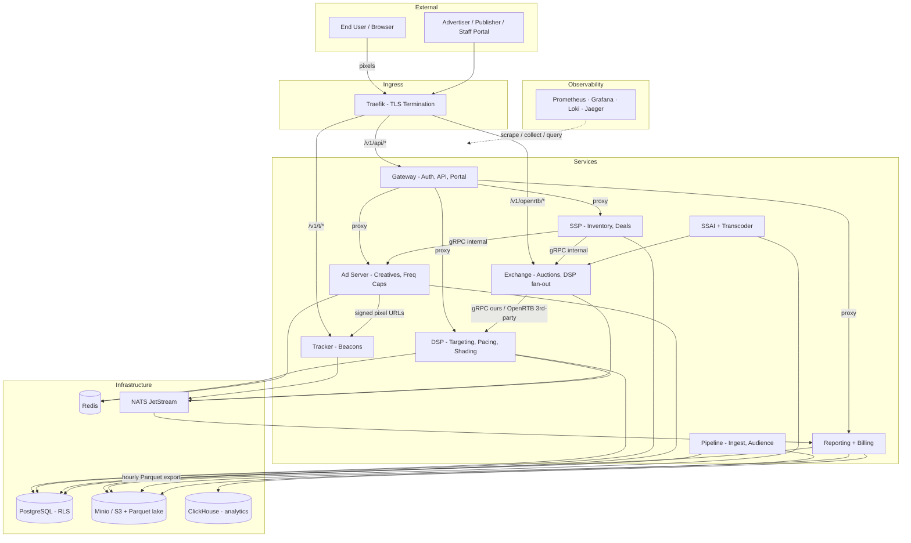

# Ad Tech Mono

[](https://github.com/MichaelJohnWatters/ad-tech-mono/actions/workflows/ci.yml)

A full-stack programmatic advertising platform in a single Go monorepo — SSP,
exchange, DSP, ad server, tracker, reporting, billing, data pipeline, and the
customer/staff portal. Everything runs locally on Kubernetes (**Rancher Desktop
k3s**, deployed via a Helm chart). The goal is full transparency: trace any ad
request end-to-end with zero data slippage.

📺 **[Watch the demo walkthrough →](https://youtu.be/LX_7pl26hVU)**

- **Architecture source of truth:** [`docs/PLAN.md`](docs/PLAN.md) (123-step, 12-phase build plan)
- **AI/context guide:** [`CLAUDE.md`](CLAUDE.md) (conventions) + per-directory `CLAUDE.md` files
- **Where to click:** [`docs/DEMO-URLS.md`](docs/DEMO-URLS.md) (the full browsable URL map)

---

## Highlights

What makes this more than a toy — the hard problems, solved end-to-end:

- **Traceable end-to-end, zero data slippage** — one `trace_id` flows from the SSP
  through exchange → DSP → ad server → tracker → NATS → reporting; the staff **Trace
  Explorer** renders every hop with timing.
- **Exactly-once money** — a double-entry ledger sourced from a single
  `AuctionWinEvent`, with reserve/settle for CPC/CPA/vCPM; load-tested
  money-lossless (biz-key + `Nats-Msg-Id` dedup).
- **Multi-tenant by construction** — Postgres **RLS** on every table + explicit
  `account_id` filtering; a bare-pool query under the app role returns 0 rows.
- **Real-time auctions** — first-price with **bid shading**, 5 strategies
  (single / relevance-weighted / batch / timeslot / pod), a **SmartRouter** that
  prunes slow/no-bid DSPs; gRPC on owned hot edges, OpenRTB on external boundaries.
- **Hot-path discipline (the iron rule)** — the per-campaign bid loop does **zero
  per-call network I/O**; budgets, caps and campaigns are warm in-process copies
  kept fresh by background refreshers.
- **Three-tier caching** — L1 in-process + L2 Redis + L3 Postgres, invalidated over NATS.
- **CTV / video / audio** — server-side ad insertion (**SSAI**) with HMAC-signed
  beacons, VAST / VMAP / DAAST, cache-first transcoding.
- **Identity & privacy** — deterministic + probabilistic identity graph, consent
  threaded through the whole chain, GDPR 3-level opt-out/purge, hashed-PII-only ingestion.
- **Beyond serving** — data marketplace, conversion attribution
  (click / view-through / cross-device), variable publisher rev-share, invoicing +
  payouts, OIDC SSO, data residency.
- **Runs the way prod does** — the same code path on k3s locally and in prod; S3
  everywhere (Minio ↔ real S3); one Helm chart with per-env values.

---

## Architecture

The synchronous serving spine is **SSP → Exchange → DSP → Ad Server → Tracker →
Reporting**, with async events over NATS JetStream. (Renders on GitHub; the staff
portal **Architecture** page has the full interactive C4 model — see below.)



Two more generated diagrams — the **ad-request sequence**, the **NATS event flow**,
and the **DB ER** model — live in [`docs/PLAN.md`](docs/PLAN.md); the interactive C4
model is in the staff portal (below).

---

## Running it

The stack runs on **Rancher Desktop (k3s)** and deploys via the Helm chart
`k8s/helm/adtech`. There is no Tilt and no Colima — the whole dev loop is the
Makefile.

### Prerequisites

- Go 1.23+
- [Rancher Desktop](https://rancherdesktop.io/) (provides k3s + the `docker`/`nerdctl` runtime)
- `kubectl` + `helm`
- `make setup` installs the prerequisites and starts local k3s for you.

### Bring the stack up

```bash
make stack-up        # build images + helm upgrade --install + run migrations
make hosts           # ONE-TIME (sudo): map every *.adtech.local host → local Traefik in /etc/hosts
make demo-warm       # non-destructive: seed + warm caches + SSAI content → fully browsable (no traffic)
```

That's it — open **https://adtech.local** and log in. Other everyday commands:

| Command | What it does |
|---|---|
| `make stack-up` | Deploy/upgrade the full stack (builds images first) + migrate |
| `make deploy SVC=dsp` | Rebuild **one** service image and restart it (the fast inner loop) |
| `make hosts` | Point all `*.adtech.local` domains at the local ingress (`/etc/hosts`, idempotent, sudo) |
| `make demo-warm` | Seed (UPSERT) + warm caches + SSAI content — makes an up stack fully browsable, **no wipe, no traffic** |
| `make reset` | **Wipe** all three stores (Postgres + ClickHouse + Redis) and re-seed — a clean slate |
| `make demo` | One-command rich setup: seed + baseline traffic |
| `make stack-doctor` | Diagnose/repair a wedged stack (post-sleep tunnels, node-IP flip, svclb) — the **first move** if it looks dead |
| `make stack-down` | Tear the stack down (keeps data PVCs; `PURGE=1` wipes them) |
| `make devconsole` | Host dev-loop UI (build/deploy buttons) at http://localhost:8099 |

> First load of an `https://*.adtech.local` site shows a one-time self-signed-cert
> warning — click through it. Full command reference lives in `k8s/CLAUDE.md`.

---

## URLs — where to click

All hostnames resolve to the local Traefik ingress **after `make hosts`** (writes
a managed block to `/etc/hosts`). No port-forward is needed to *browse*; `localhost`
ports are only for host CLI tools / e2e and require `make demo-forward`.

### Portal + the showcase

| URL | What |
|---|---|
| **https://adtech.local** | The portal (one gateway; advertiser / publisher / staff / ops views depend on who you log in as). REST API at `/v1/api/*`, Swagger at `/docs`. |
| https://gateway.adtech.local | Same gateway (explicit host). The staff **Architecture** (C4 diagrams) and **Ops** sections live here. |
| https://shop.adtech.local | Demo advertiser shop — fires the retargeting pixel + signed conversion postback (the CPA money loop). |

**Demo publisher sites** (each its own brand — the showcase):

| URL | Mimics | Ad format |
|---|---|---|
| https://viewtube.adtech.local | YouTube | VMAP video (`/watch/1..3` = pre / pre+mid / +post) |
| https://twitchr.adtech.local | Twitch | Continuous **live SSAI** channel |
| https://soundwave.adtech.local | Spotify | DAAST audio |
| https://primereel.adtech.local | Netflix | Pre-roll video |
| https://chronicle.adtech.local | A newspaper | Display + native in articles |
| https://gadget.adtech.local | A tech blog | Display + native in a review feed |

Every site has a collapsible **"behind the scenes" trace panel** (live ad calls,
auction outcome, SSP-resolved audience segments).

**Platform services** are reachable directly too for debugging:
`ssp` · `exchange` · `dsp` / `dsp-int` · `dsp-comp1..4` · `adserver` · `pubad` ·
`tracker` (all `.adtech.local`). Observability: Grafana, Jaeger, Loki.

### Dev logins (planted by the seed)

| Login | Role |
|---|---|
| `admin@adtech.local` / `admin` | Staff (sees everything, incl. Architecture + Ops) |
| `advertiser@adtech.local` / `admin` | Advertiser (Globex) |
| `publisher@adtech.local` / `admin` | Publisher (Daily News) |
| `devops@adtech.local` / `admin` | Staff ops (the Ops console) |

### localhost fallback (host tools / e2e only)

`make demo-forward` (run in its own terminal) port-forwards `localhost` ports for
CLI tools that hardcode them — gateway `:8080`, exchange `:8081`, dsp `:8082`,
tracker `:8083`, ssp `:8084`, adserver `:8085`, reporting `:8086`, grafana `:3000`,
jaeger `:16686`, etc. **You don't need it to browse** — the domains above work on
their own. Full table in [`docs/DEMO-URLS.md`](docs/DEMO-URLS.md).

---

## Traffic simulator

`cmd/simulator` generates production-like traffic (persona × channel, signed
beacons, synthesised conversions) and drives the whole path: auction → bid → win →
impression → viewability → maybe click → NATS → reporting.

```bash
make traffic                       # continuous gentle traffic (DEMO_RPS, default 5). Ctrl-C to stop.
make demo                          # seed + baseline traffic (one-command rich setup)

# direct CLI
go run ./cmd/simulator single --geo GBR --device mobile   # one auction, see every hop
go run ./cmd/simulator run --profile steady --duration 5m # 10 rps for 5 min
go run ./cmd/simulator check                              # are services ready?
```

Load / performance runs (the money invariant + phase metrics):

```bash
make loadtest RPS=110 DURATION=10m VERIFY=1   # full-path load; VERIFY asserts reporting counts match
make loadtest-ramp                            # progressive RPS stages, aborts on degradation
```

The full performance protocol (reset → seed big world → warm → run → read phase
metrics + money canary) is the **`/perf-loadtest`** skill
(`.claude/skills/perf-loadtest/SKILL.md`). For cluster-free compute
micro-benchmarks and the configurable load-gen GUI, see **`/perf-microbench`**
(`make bench`, `make bench-gui`).

---

## Running the tests

Layered — pure logic is unit-tested; anything spanning services gets an e2e
against the **live stack**. (Conventions: no mocks for Postgres/Redis/NATS; use
fakes in `pkg/testutil` for unit, testcontainers for integration.)

| Command | Layer | Needs |
|---|---|---|
| `make test` | **Unit** — `go test ./pkg/... ./cmd/...` | nothing |
| `make test-integration` | **Integration** — `-tags=integration`, real Postgres/Redis/NATS | Docker (testcontainers) |
| `make test-e2e` | **End-to-end** — `-tags=e2e` against the running stack (~190 tests, real ClickHouse) | stack up + seeded |
| `make test-e2e-security` | **Security/auth e2e** — authn, RBAC, tenant isolation, consent, forged-header strip, rate limits, CSRF, SQLi | stack up + seeded |
| `make test-e2e-chaos` | **Chaos e2e** — kills infra pods to prove fail-open (opt-in; destabilises other tests) | stack up |
| `make bench` | **Hot-path micro-benchmarks** — diff vs baseline via benchstat (regression → function + commit) | stack **down** |
| `make loadtest` | **Performance** — full-path load + money invariant | stack up + seeded |
| `make test-all` | Every layer | — |

```bash
make test                                  # all unit tests
go test ./pkg/auction/ -run TestX -v       # one test
go test ./pkg/... -race                    # race detector
make lint                                  # golangci-lint + buf lint
```

> Always run e2e against the **full** deployed stack, never a partial one — see
> `tests/e2e/` for the per-slice shape (register → act → assert persistence + the
> negative/RBAC case).

---

## Architecture diagrams — where to look

Two places, both generated from source (never hand-drawn):

1. **In the staff portal → Architecture page.** Log in as staff at
   **https://adtech.local** → **Architecture**. It renders the **C4 model** —
   Context / Containers / per-service Component views. Source is the single DSL in
   [`docs/diagrams/workspace.dsl`](docs/diagrams/workspace.dsl); `make c4`
   re-exports it into `web/static/diagrams/`.

2. **In the repo: [`docs/diagrams/`](docs/diagrams/).** D2 source + rendered SVGs
   for the data/money/event **flow** diagrams (auction, billing, cache freshness,
   data lifecycle, e2e trace, …). The index with a per-diagram "update when" column
   is [`docs/diagrams/README.md`](docs/diagrams/README.md); `make diagrams`
   re-renders the SVGs and syncs them into the portal.

**Rule:** a change that alters how services connect, or a data/money/event flow,
updates the matching diagram in the same PR.

---

## High-level project structure

A Go monorepo: one module, service binaries under `cmd/`, all shared logic under
`pkg/` (nothing external). The synchronous serving spine is
**SSP → Exchange → DSP → Ad Server → Tracker → Reporting**, with async events over
NATS JetStream and three data stores (Postgres transactional, ClickHouse analytics,
S3/Parquet lake).

```
ad-tech-mono/
├── cmd/            Service entrypoints — one binary per service/job/host-tool
│   ├── gateway/        API + portal (advertiser/publisher/staff/ops) + REST + proxy
│   ├── ssp/            Supply-side: publisher inventory, builds bid requests
│   ├── exchange/       Auctions, DSP fan-out, deal priority, SmartRouter
│   ├── dsp/            Demand-side: targeting, pacing, bid shading, budgets
│   ├── adserver/       Creative serving, tracking URLs, freq caps
│   ├── tracker/        Impression/click/conversion/viewability beacons
│   ├── reporting/      NATS consumer → analytics; hosts the billing engine
│   ├── pipeline/       Data ingest/validate/enrich + audience changelog drainer
│   ├── ssai/ transcoder/           Server-side ad insertion (CTV/video/audio)
│   ├── publisher-adserver/         Direct-sold vs programmatic arbitration
│   ├── {webhooks,notifications,identity-consumer,audience-rt,report-runner}/  async workers
│   ├── {seed,migrate,batch-conductor,*-runner,dayboundary}/                   jobs & CronJobs
│   └── {simulator,demosite,demoadv,extbidder,devconsole}/                     host tools
├── pkg/            Shared libraries — auction, targeting, pacing, bidshading,
│                   billing, store/*, events, cache, openrtb, config, auth, privacy…
├── web/            Go templates + HTMX + Tailwind + the adtech.js SDK (no JS build)
├── k8s/            Helm chart `helm/adtech` (per-env values) + frozen `base/` (parity reference)
├── build/          Dockerfiles
├── migrations/     goose SQL migrations (every table has an RLS policy)
├── profiles/       Seed data, simulation personas, publisher/bench configs
├── docs/           PLAN.md, openapi.yaml, diagrams/, ADRs, DEMO-URLS.md
├── python/         ML model training (fraud, optimisation) — the only non-Go code
└── tests/e2e/      End-to-end suites (-tags=e2e) against the live stack
```

Working on a specific area? Read that directory's own `CLAUDE.md` first (there's
one in every `cmd/*` and most `pkg/*`), then `docs/PLAN.md` for the design rationale.

---

## Tech stack

- **Language:** Go everywhere (backend, frontend, tooling). Python only for ML.
- **Frontend:** Go templates + HTMX + Tailwind CSS — no JS build pipeline.
- **Protocols:** gRPC on owned internal hot edges (`pkg/grpcx`, `grpc://` vs `http://`
  by config), OpenRTB JSON/HTTP on every external bidding boundary, NATS JetStream
  for async events (JSON payloads), HTTP/JSON for the dashboard + API.
- **Databases:** PostgreSQL (transactional, RLS multi-tenancy), ClickHouse/DuckDB
  (analytics), Parquet on S3 (the data lake).
- **Object storage:** S3 everywhere — Minio locally, real S3 in staging/prod (one code path).
- **Caching:** L1 in-process + L2 Redis + L3 Postgres, invalidated over NATS.
- **Infrastructure:** Kubernetes everywhere (Rancher Desktop k3s local, k3s prod),
  Helm chart with per-env values; `make stack-up` / `make deploy SVC=x` dev loop.
- **Observability:** slog, Prometheus + Grafana, Loki, Jaeger (OpenTelemetry tracing).

See [`docs/PLAN.md`](docs/PLAN.md) for the full architecture and the 12-phase plan.
