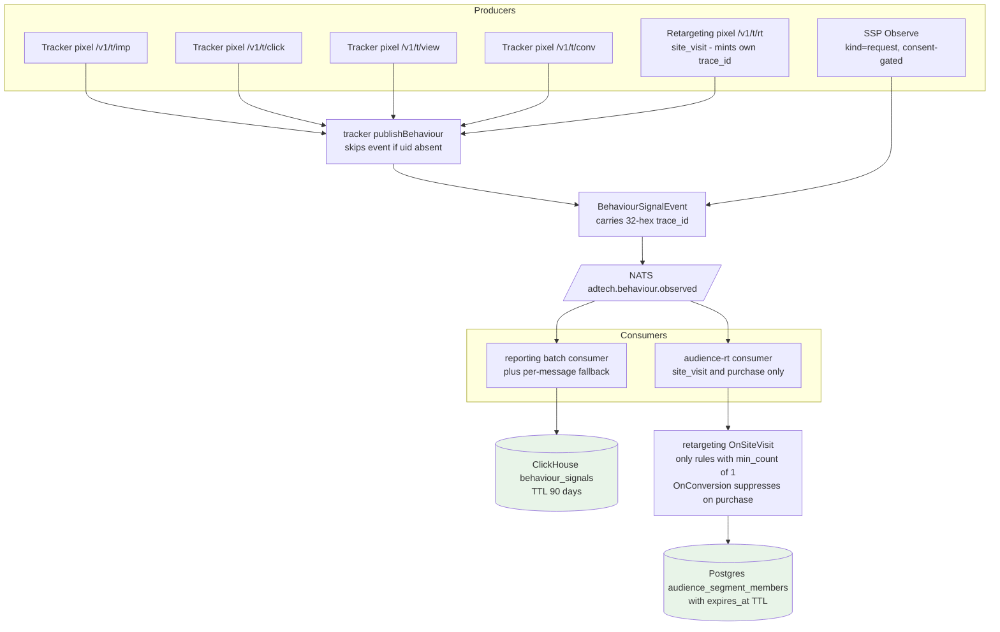
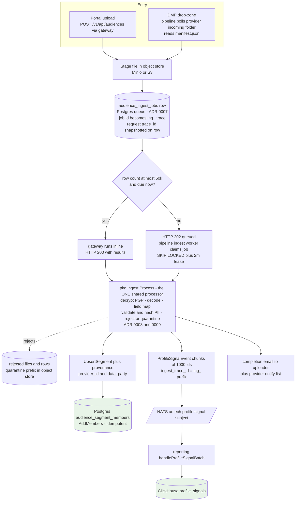
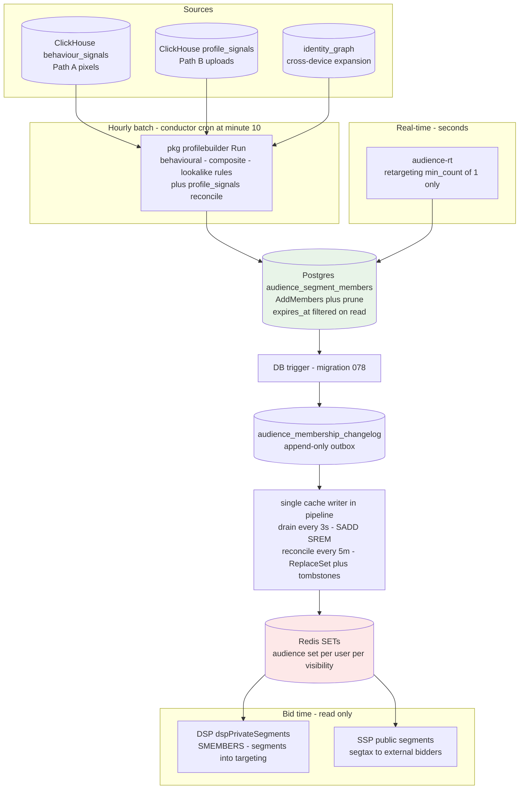
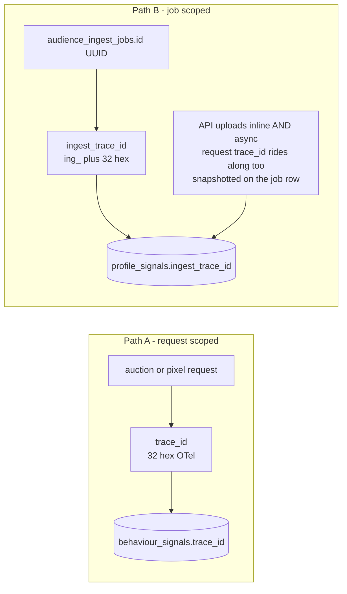
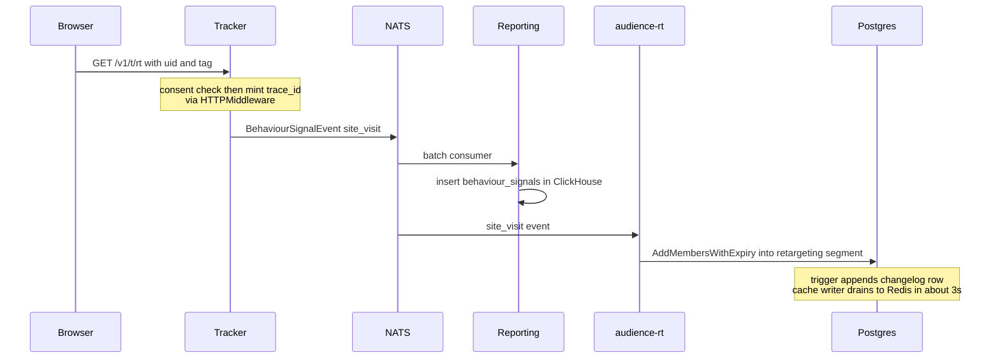
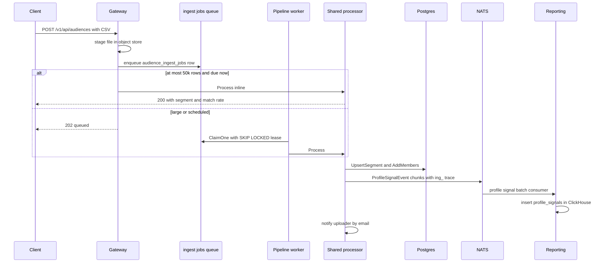

# How Audience Data Enters the Platform — The Two Paths

Audience data enters the platform exactly two ways:

- **Path A — behaviour signals from pixels**: real-time interactions (impressions,
  clicks, views, conversions, retargeting site visits, and consented ad requests)
  land as rows in ClickHouse `behaviour_signals`, with a real-time branch that
  enrolls retargeting audiences within seconds.
- **Path B — file ingest**: uploaded audience lists (portal upload or DMP
  drop-zone) land as `audience_segment_members` rows in Postgres **and** as rows
  in ClickHouse `profile_signals`.

The paths converge in the hourly **profile-builder** batch (which evaluates
segment rules over both ClickHouse tables) and in the **membership cache**
(Postgres → change-log → Redis SETs) that the DSP/SSP read at bid time.

A hard invariant worth stating up front: **pixels never write `profile_signals`,
and uploads never write `behaviour_signals`.** The two tables have disjoint
producers and different correlation-id formats (see §4).

---

## 1. Path A — pixel and SSP behaviour signals (real-time)

**Walkthrough.**

- **Producers.** Five tracker pixel endpoints call `publishBehaviour`
  (`cmd/tracker/main.go:781`): `/v1/t/imp` (main.go:304), `/v1/t/click` (:367),
  `/v1/t/view` (:581), `/v1/t/conv` (:477), and `/v1/t/rt` (:397, kind
  `site_visit`). Separately, the SSP emits one `kind="request"` row per
  **consented** ad request via `Observe` (`cmd/ssp/behaviour.go:46-73`, called
  from the auction path in `cmd/ssp/main.go:683`); consent is checked at
  `behaviour.go:50` via `privacy.Evaluate(...).Personalise`.
- **Consent gating is structural, not just a check.** The ad server only bakes
  a `uid=` param into beacon URLs when the serve was consented
  (`pkg/models/models.go:380-386`, `BehaviourUserID`), and `publishBehaviour`
  returns early when `uid` is empty (`cmd/tracker/main.go:782-785`) — so a
  non-consented render produces **no** behaviour row at all. The retargeting
  pixel, which has no upstream serve, re-checks consent itself
  (`cmd/tracker/main.go:396`).
- **trace_id.** Every event carries a real 32-hex OTel trace_id. Beacons pass
  the auction's trace via `?tid=`; the retargeting pixel has no upstream
  auction, so the tracker falls back to the trace minted by its own
  HTTPMiddleware: `firstNonEmpty(q.Get("tid"), tracing.TraceIDFromContext(ctx))`
  (`cmd/tracker/main.go:793`). The advertiser tag `adtech-adv.js` no longer
  sends a client tid.
- **Wire.** `events.BehaviourSignalEvent` (`pkg/events/payloads.go:315-343`:
  trace_id, kind, user_id, household_id, placement/publisher/campaign/creative,
  channel, categories, geo, device, account_id, tag, observed_at) on subject
  `adtech.behaviour.observed` (`pkg/events/subjects.go:115`).
- **Consumer 1 — reporting → ClickHouse.** `handleBehaviourSignalBatch`
  (`cmd/reporting/batch.go:472-495`; per-message fallback at :547-572 when the
  batch consumer is disabled) inserts via `InsertBehaviourSignals`
  (`pkg/store/analytics/clickhouse_batch.go:215-237`) into the
  `behaviour_signals` MergeTree table (`pkg/store/analytics/clickhouse.go:195-203`,
  90-day TTL to cover 30-day rule windows). There is deliberately no business
  dedup key: one trace legitimately produces several behaviour rows.
- **Consumer 2 — audience-rt (real-time retargeting).** `cmd/audience-rt` (one
  replica, durable queue-grouped JetStream consumers, `main.go:91-94`)
  subscribes to behaviour + conversion events. `OnSiteVisit`
  (`pkg/retargeting/retargeting.go:88-131`) enrolls the visitor into the
  advertiser's matching retargeting segments **within seconds** — but only for
  rules with `min_count <= 1` (`retargeting.go:102`); frequency rules belong to
  the batch builder. `OnConversion` (`retargeting.go:137-163`) removes the user
  from all retargeting segments on a purchase. Members get a TTL from the
  rule's `window_days` (`cmd/audience-rt/main.go:236-242`,
  `AddMembersWithExpiry`), and expired rows are filtered at read time and
  purged by a background sweep (`cmd/audience-rt/main.go:111-134`).

---

## 2. Path B — audience file ingest (batch)

**Walkthrough.**

- **Entry 1 — portal upload.** `handleUpload`
  (`cmd/gateway/audiences.go:289-500`) stages the file to the object store at
  `api/{accountID}/{uuid}/{file}.csv` (audiences.go:440), snapshots provider
  defaults onto the spec (data_party, licence, encryption_expected, id_type —
  audiences.go:362-386, ADR 0009), collects notify emails (uploader from JWT →
  `team_members`, plus request extras, plus provider defaults —
  audiences.go:415-421), and enqueues one `audience_ingest_jobs` row
  (audiences.go:472).
- **Inline vs async.** `rowCount <= inlineMaxRow && !runAt.After(now)`
  (audiences.go:488) — small (default **50,000** rows,
  `gateway.ingest_inline_max_rows`, `pkg/config/keys/gateway.go:77`) **and**
  due-now files run inline in the request (`runInline`, audiences.go:506-567 —
  claim by ID, process, 200 with segment/match-rate). Anything larger or
  scheduled for later returns **202 queued**.
- **Entry 2 — drop-zone.** The pipeline's onboarder polls the onboarding
  bucket for `{provider}/incoming/` files (`cmd/pipeline/onboarding.go:264-322`),
  loads `{provider}/manifest.json` (account_id required; onboarding.go:433-446),
  and enqueues the same job type. Bad manifest → quarantine the file; transient
  read error → leave it for the next tick.
- **Queue semantics (ADR 0007).** `pkg/ingestjobs/store.go`: `ClaimOne` uses
  `FOR UPDATE SKIP LOCKED` on due queued jobs with a 2-minute lease
  (store.go:175-188), heartbeat extension, and `ReclaimExpired` crash recovery
  at worker boot (`cmd/pipeline/ingest_worker.go:37`); a partial unique index on
  `(file_bucket, file_key)` for active jobs makes Enqueue idempotent.
- **The ONE processor.** Gateway-inline and the async worker
  (`cmd/pipeline/ingest_worker.go:28-130`) both call the same
  `Process` (`pkg/ingest/processor.go:146-363`): read staged object → PGP
  decrypt (`pgp.MaybeDecrypt`, processor.go:162; a provider with
  `encryption_expected` **rejects cleartext**, processor.go:170-172, ADR
  0008/0009) → decode CSV/JSON → merge tenant field mappings
  (processor.go:182-190, ADR 0008) → validate + hash PII via `pkg/pipeline`
  (processor.go:192-197; whole file rejected if reject% exceeds
  `ingest.max_reject_pct`) → rejects quarantined to a `rejected/` prefix with an
  `.error.txt` marker (processor.go:202-207).
- **Two writes.** (1) `UpsertSegment` + `SetSegmentProvenance` (provider_id,
  data_party — processor.go:280-288) + `AddMembers` into Postgres
  `audience_segment_members` (processor.go:290, `INSERT … ON CONFLICT DO
  NOTHING`, so re-runs are idempotent). (2) `ProfileSignalEvent`s published in
  chunks of **1,000 ids** (processor.go:47, 316-348) on
  `events.SubjectProfileSignal`; reporting's `handleProfileSignalBatch`
  (`cmd/reporting/batch.go:509-540`) expands each chunk to one ClickHouse
  `profile_signals` row per id. Match rate is computed against the identity
  graph (`Matcher.CountKnownIdentifiers`, processor.go:299-307) and stored on
  the segment.
- **Completion emails (ADR 0008).** Both runners call `ingest.NotifyResult`
  (`pkg/ingest/notify.go:21-55`) on terminal state — one message per recipient,
  best-effort (a send failure never fails the ingest).

---

## 3. Convergence — where both paths become "an audience"

**Walkthrough.**

- **Batch evaluation (hourly).** The batch-conductor CronJob (`"10 * * * *"`,
  `k8s/cronjobs/batch-conductor/cronjob.yaml:26`) runs `StandardChain`
  (`pkg/batch/chain.go:68-214`): checkpoint → ch-parquet-export → rollups →
  **profile-builder** (chain.go:162-176) → privacy. `profilebuilder.Run` reads
  ClickHouse through `CHBehaviourQuerier` (`pkg/profilebuilder/querier.go:183-265`):
  `QualifyingUsers` (behavioural rules — min_count within window_days over
  `behaviour_signals`), `CategorySignals` (lookalike profiling), and
  `SegmentMemberships` (reconciling `profile_signals` → members). Composite
  rules (all_of/any_of/none_of) evaluate at **person** level using identity
  clusters (`pkg/profilebuilder/rules.go:24-87`, `builder.go:107-128`).
  Membership writes are AddMembers + `RemoveMembersNotIn` prune
  (`builder.go:319-335`).
- **Real-time exception.** Retargeting rules with `min_count <= 1` never wait
  for the hour: audience-rt enrolls them from the live event stream (§1).
  Frequency-based retargeting (`min_count > 1`) is explicitly skipped there
  (`pkg/retargeting/retargeting.go:102`) and owned by the batch builder.
- **Membership cache (append-based, no per-pod rebuild).** Every
  insert/delete on `audience_segment_members` fires a trigger
  (`migrations/078_membership_changelog_trigger.sql:11-37`) that appends to
  `audience_membership_changelog` (`migrations/077_...sql:8-16`) in the same
  transaction — so batch writes, real-time enrolls, and purchase suppressions
  all flow through one outbox. A **single writer**
  (`cmd/pipeline/audience_cache_writer.go`) drains it every 3s
  (`audience.changelog_poll_interval`) with atomic SADD/SREM on
  `audience:set:{userID}:{visibility}` (writer:222-269), keeps its watermark in
  Redis (`audience:changelog:watermark` — survives an e2e FLUSHDB/reset), and
  reconciles fully every 5m (`ReplaceSet` + prev-keys tombstoning of vanished
  users, writer:274-316).
- **Bid time.** The DSP resolves the user (and household) to segment ids via
  `dspPrivateSegments` (`cmd/dsp/identity.go:169-203`, called from
  `cmd/dsp/main.go:866-891`) using the read-only preloader — a plain `SMEMBERS`
  (`pkg/audience/store/preload/preload.go:88`) that degrades to empty on Redis
  error, with cached/direct-Postgres fallbacks selected at boot
  (`cmd/dsp/main.go:469-512`). Postgres reads always apply the `expires_at`
  filter (`pkg/audience/store/postgres/postgres.go:123-128`, migration 073), so
  aged-out retargeting members never target. Segment ids feed targeting
  evaluation; matching itself lives in `pkg/targeting`, not the audience store.

---

## 4. Correlation ids — `trace_id` vs `ingest_trace_id`

| | Path A (pixels) | Path B (uploads) |
|---|---|---|
| Id | `trace_id` — 32-hex OTel W3C | `ingest_trace_id` — `"ing_" + jobUUID` sans dashes (`pkg/ingestjobs/ingestjobs.go` `Job.Trace`) |
| Scope | one request/serve | one ingest job (the whole file) |
| Origin | SSP/tracker HTTPMiddleware; beacons pass `?tid=`; `/v1/t/rt` mints its own (`cmd/tracker/main.go:793`) | the `audience_ingest_jobs` row id — deterministic, replay-safe |
| Lands in | `behaviour_signals.trace_id`, logs, Jaeger | `profile_signals.ingest_trace_id`, ingest-path logs (`trace_id` field), membership `origin_trace`; **API** uploads (inline or async) also carry the HTTP request's real `trace_id` — snapshotted onto the job at enqueue (migration 079), so only drop-zone rows leave it empty |
| Why distinct | a request trace pivots to Jaeger/Loki | uploaded data is **batch**, not request-scoped; the `ing_` prefix is self-identifying and can never be mistaken for a request trace (verified by `tests/e2e/demo_onboarding_ingest_trace_test.go:69-75`) |

A third column joins them at the membership layer: every `audience_segment_members`
row carries `source` + `origin_trace` (migration 080) — `ing_…` for uploads, the
enrolling site-visit's 32-hex trace for real-time retargeting, `batch_<32hex>`
(joins `batch_runs.run_id`) for hourly profile-builder enrolments. Lineage is
first-writer-wins: re-runs and repeat visits never overwrite the original origin.

Rationale doc: `docs/AUDIENCE_DATA_PATH_SCALING.md`.

---

## 5. Sequence views (one fire of each)

---

## 6. Is anything missing or inconsistent?

The two paths are cleanly separated and the stated invariants hold in code:
`profile_signals` is written only by the ingest processor (plus the demo
onboarding path, which runs the same real ingest), `behaviour_signals` only by
the tracker/SSP event stream, and the id formats cannot collide. The one shared
processor (ADR 0007) genuinely is shared — gateway-inline and the pipeline
worker call the identical `Process`, so validation, PGP, provenance, quarantine
and notification behave the same on both routes. Three correlation gaps found
by the original audit were closed (migrations 079/080): (1) async API uploads
used to drop the uploader's request trace — it is now snapshotted onto the job
row at enqueue and rides `profile_signals.trace_id` regardless of inline vs
async, leaving only drop-zone rows (which have no request) without one;
(2) ingest-path logs used to carry only the dashed job UUID — every log line
now stamps the `ing_…` id as `trace_id`, so the same string greps ClickHouse,
Loki and the event payloads; (3) membership rows had no lineage — `source` +
`origin_trace` now stamp every writer (upload `ing_…`, real-time retargeting
site-visit trace, profile-builder `batch_<run>`), first-writer-wins. Remaining
accepted asymmetry: behaviour rows for non-consented traffic are simply absent
(the uid never reaches the beacon), so consent is enforced at capture while
already-captured rows age out via the 90-day ClickHouse TTL and the GDPR
purger. One operational footnote: the ClickHouse behaviour write path is gated
by `reporting.clickhouse_batch_consumer`; with it off, the slower per-message
fallback engages — same table, same data, just lower throughput. No gaps found
that would let audience data enter by a third, untracked route.
