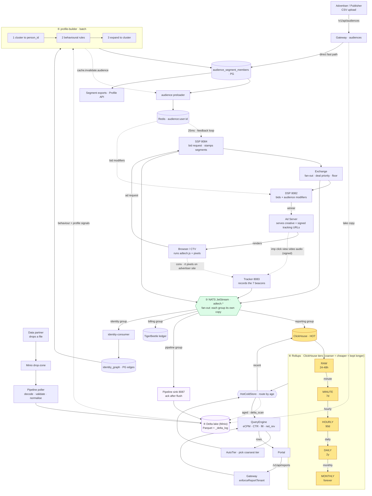

# Data lifecycle — one linear walk from data-in to audience + rollups

The other diagrams each show *one segment* of the data story
([`auction-flow`](auction-flow.svg) = serving, [`nats-events`](nats-events.svg) =
fan-out, [`data-reporting`](data-reporting.md) = hot/cold, [`data-pipeline`](data-pipeline.svg)
= the lake, [`targeting-data-flow`](targeting-data-flow.svg) = audience). This
page is the **single linear thread** that connects them: where every byte comes
from, how the auction produces it, how it becomes an audience, and how it rolls
up into dashboard numbers.

Read it top-to-bottom. There is **one input funnel**, then the stream **forks
into two spines** that never touch each other except through four small feedback
loops (marked ⟲).

```
╔══════════════════════════════════════════════════════════════════════════════╗
║  STAGE 1 — WHERE DATA COMES FROM   (two lanes: you don't control who, only how)║
╚══════════════════════════════════════════════════════════════════════════════╝

  LANE A · OBSERVED (exhaust)                  LANE B · ONBOARDED (1st + 3rd party)
  the platform watches things happen           someone hands us a list of people
  ───────────────────────────────             ────────────────────────────────────
  Browser / CTV device                         Advertiser / Publisher      Data partner
        │ loads adtech.js                             │ CSV/TSV upload            │ drops a file
        │  + pixels                                   │ (PII hashed in browser)   │ csv/tsv/parquet
        ▼                                             ▼                           ▼
  ┌───────────────┐   ┌──────────────────┐    ┌────────────────────┐   ┌──────────────────────┐
  │ Ad request    │   │ Tracker :8083    │    │ Gateway            │   │ Minio drop-zone      │
  │ → SSP :8084   │   │ imp/click/       │    │ /v1/api/audiences  │   │ adtech-onboarding/   │
  │ (user_id,uid2,│   │ conv/view        │    │ (match rate/upload)│   │  <provider>/incoming │
  │ hashed_email, │   │                  │    └─────────┬──────────┘   └──────────┬───────────┘
  │ ifa, IP→hh,   │   │ Retargeting      │              │                         │ Pipeline poller:
  │ page context) │   │ pixel /v1/t/rt   │              │                         │ decode→validate→
  └──────┬────────┘   │ → site_visit rows│              │                         │ normalise→quarantine
         │            └───────┬──────────┘              │                         │
         │                    │                         │                         │
         └──── these two feed THE AUCTION (stage 2) ─────┘   both onboarded paths ─┘
                    and emit events (stage 3)                land in stage 4 (lake)
                                                             + write segments directly (stage 5)

╔══════════════════════════════════════════════════════════════════════════════╗
║  STAGE 2 — THE AUCTION  (the "observed" lane is really the exhaust of THIS)     ║
╚══════════════════════════════════════════════════════════════════════════════╝

   SSP :8084 ──▶ Exchange ──▶ DSP :8082 ──▶ (winner) ──▶ Ad Server ──▶ Browser renders
   builds bid    fan-out to    each DSP       first-price   returns the    the creative
   request,      DSPs, deal    bids; unions   auction +     creative +     │
   stamps        priority      audience bid   bid shading   tracking URLs  │ user sees / clicks
   user.ext      (PG>Pref>     modifiers      + floor                      │
   .segments     PMP>Open),    into price                                  ▼
   ⟲(from        floor                                          Tracker :8083 records
   Redis, 25ms)  enforced                                       impression / click /
                                                                conversion / viewability
                                                                        │
        every step writes a row with the SAME trace_id ────────────────┘
        (SSP-minted, W3C 32-hex; flows through logs, NATS, ledger, lake)

╔══════════════════════════════════════════════════════════════════════════════╗
║  STAGE 3 — THE EVENT BUS  (one stream in, many independent readers out)         ║
╚══════════════════════════════════════════════════════════════════════════════╝

                        Tracker + Exchange + SSP  publish protobuf events
                                          │
                                          ▼
                        ╔═════════════════════════════════╗
                        ║   NATS JetStream (durable)       ║
                        ║   adtech.* subjects              ║
                        ╚═════════════════════════════════╝
        each consumer group gets its OWN copy (fan-out, not load-balanced):
   ┌───────────────┬──────────────────┬────────────────┬───────────────┬──────────────┐
   ▼               ▼                  ▼                ▼               ▼              ▼
 reporting       pipeline           billing         identity-       webhooks     notifications
 group           group              group           consumer        group        group
 (→ HOT +        (→ COLD lake)      (→ TigerBeetle   group           (HTTP POST)  (bell rows)
  rollups)                           ledger)         (→ id graph)
   │               │                                    │
   │ STAGE 6       │ STAGE 4                             │ STAGE 5 (identity spine)
   ▼               ▼                                     ▼

╔══════════════════════════════════════════════════════════════════════════════╗
║  STAGE 4 — THE LAKE  (cold store: every event as a replayable Parquet fact)     ║
╚══════════════════════════════════════════════════════════════════════════════╝

   Pipeline :8087 datalake sink                       Delta lake (Minio / S3)
   ┌──────────────────────────────┐    writes     ┌──────────────────────────────────┐
   │ per-subject handler           │──────────────▶│ event_date=YYYY-MM-DD/            │
   │  → per-table buffer           │  Parquet +    │   part-NNNNN.parquet  (7 event    │
   │  → ACK ONLY after durable      │  Delta commit │   tables + behaviour_signals +    │
   │    flush (at-least-once)       │               │   profile_signals + id_clusters)  │
   └──────────────────────────────┘               │ _delta_log/  (real Delta protocol)│
        ▲                                          └──────────────────────────────────┘
        │ onboarded rows (stage 1 lane B)            single writer = pipeline, always:
        │ also land here as profile_signals          · compaction (bin-pack, via pipeline)
        └────────────────────────────────           · GDPR purge (filtered rewrite)
                                                     · keep-forever (ML training corpus)

╔══════════════════════════════════════════════════════════════════════════════╗
║  STAGE 5 — BECOMING AN AUDIENCE  (where the two source lanes finally MEET)      ║
╚══════════════════════════════════════════════════════════════════════════════╝

   IDENTITY SPINE (who is the same person / household)
   NATS ─▶ identity-consumer ─▶ identity_graph (PG edges, dedup upsert)
   onboarded /v1/api/identity-links ─▶ crm_match edges ──────────────┘
                                                       │
                                                       ▼
   ┌────────────────────────────────────────────────────────────────────────────┐
   │ profile-builder   (a step in the batch-conductor chain, runs on a schedule)  │
   │   reads: identity_graph (PG)  +  behaviour_signals & profile_signals (lake)  │
   │   ①  cluster graph → person_id            (union-find over the id edges)      │
   │   ②  behavioural rules (pure-Go over the Delta reader) + reconcile windows    │
   │   ③  expand: enroll the person, fan out to EVERY id in their cluster          │
   └───────────────────────────────┬────────────────────────────────────────────┘
                                    │ writes
                                    ▼
   audience_segment_members (PG)  ──▶ audience preloader ──▶ Redis
                                       (interval bulk push)   audience:user:<id>:<vis>
                                    │                              │
   ⟲ FEEDBACK LOOP: publishes      │                              │ 25ms hot-path read
     cache.invalidate.audience     │                              ▼
     so the loop below refreshes    │                    back into STAGE 2:
                                    │                    · SSP stamps user.ext.segments
   OUTPUTS:                         │                    · DSP applies audience bid modifiers
   · Segment exports (CSV/Parquet via report jobs)
   · Profile API  GET /v1/api/profiles/<id>  (staff, support:read)
   NOTE: onboarded uploads (stage 1 lane B) can ALSO write segment members
         directly — the live "fast path" — while the lake copy feeds the builder.

╔══════════════════════════════════════════════════════════════════════════════╗
║  STAGE 6 — ROLLUPS  (the HOT spine: raw events → ever-coarser summaries)        ║
╚══════════════════════════════════════════════════════════════════════════════╝

   Reporting :8086 NATS consumer ──▶ ClickHouse (raw events)
                                          │  each tier aggregates the previous and
                                          │  the daily/monthly jobs PURGE the finer one
                                          ▼
   RAW events ──min──▶ MINUTE ──hour──▶ HOURLY ──day──▶ DAILY ──month──▶ MONTHLY
   group by: trace_id  campaign/creative/placement/geo/device            (+ ROAS)
   retain:   24–48h    7 days          90 days         2 years           forever
   run by:   —         rollup-minute   rollup-hourly   rollup-daily      rollup-monthly
             (raw)     (every min)     (every hour)    (00:30 UTC,       (1st @01:00,
                                                        purges raw>48h    purges
                                                        + minute>7d)      hourly>90d)

   READ PATH  (portal asks a question):
   Portal ─▶ Gateway (enforceReportTenant: injects account/publisher scope)
          ─▶ QueryEngine (computes eCPM/CTR/fill_rate/net_revenue SERVER-SIDE)
          ─▶ AutoTier (picks the coarsest tier that answers the range)
          ─▶ HotColdStore (routes by age vs hot_window):
                recent  → ClickHouse (HOT)
                aged    → Delta lake  (COLD, DuckDB delta_scan)   ← stage 4
                spanning→ split + additive merge of both
          ─▶ rows back to the portal (no browser math)
```

## The same flow, rendered (Mermaid — for GitHub)

The ASCII above is the terminal view; this is the identical story as a rendered
flowchart. Solid arrows = sync/data flow, dotted = async or feedback loop.



## The pixels — who fires what, and what it triggers

"The tracker" in stage 1/2 is really **seven beacons** (`/v1/t/*` on the Tracker
:8083). They split into two families by *who places the pixel*, and each one
triggers a different downstream effect. Every ad-served beacon is **HMAC-signed**
by the ad server; a tampered beacon is `403`'d when `tracker.signature_validation`
is on.

**Family 1 — ad-server-emitted** (baked into the served creative's tracking URLs,
signed; these measure the ad and drive the money loop):

| Pixel | Endpoint | Fires when… | Triggers downstream |
|---|---|---|---|
| Impression | `/v1/t/imp` | the ad renders | **billing accrual** — spend is booked *here*, not on the auction win |
| Click | `/v1/t/click` | user clicks (redirect tracker) | **CPC settle** + click row |
| Viewability | `/v1/t/view` | IAB viewable threshold met | **vCPM settle** (viewable→settle; non-viewable reservation expires) |
| Video | `/v1/t/video` | VAST quartiles / completion | video engagement rows (**CPCV** settle on complete) |
| Audio | `/v1/t/audio` | DAAST audio events | audio engagement rows |

**Family 2 — advertiser-placed** (the advertiser embeds these on their *own*
site; the gateway generates the snippet so the URL is never hardcoded):

| Pixel | Endpoint | Placed on… | Triggers downstream |
|---|---|---|---|
| Conversion | `/v1/t/conv` | advertiser thank-you / purchase page | **CPA settle** + conversion attribution (matched back by `trace_id`) |
| Retargeting | `/v1/t/rt` | advertiser product / category pages | **`site_visit` rows** → feed audience segments (this is how "visited but didn't buy" becomes a targetable list — stage 5) |

**The pixel that isn't a pixel:** identity/household signals (`user_id`, `uid2`,
`hashed_email`, `ifa`, `IP→household`) don't ride a separate sync pixel — they
arrive on the **ad request itself** at the SSP (stage 2), then flow to the
identity graph. So "how do we know who this is" and "did the ad work" enter
through *different* doors.

Every one of these seven, once recorded, publishes to NATS (stage 3) and so
lands in **both** the hot rollups (stage 6) and the cold lake (stage 4) — plus
billing (settles) and, for `/v1/t/rt`, the audience spine (stage 5).

## The one-sentence version of each stage

1. **Sources** — two lanes: *observed* (pixels + auction exhaust) and *onboarded*
   (1st/3rd-party lists via upload or a Minio drop-zone). You control *how* data
   arrives, never *who* it's about.
2. **Auction** — SSP→Exchange→DSP→win→AdServer→Tracker. The "observed" lane is
   literally the exhaust of this pipe; one `trace_id` stitches every row.
3. **Event bus** — one durable NATS stream; each consumer group (reporting,
   pipeline, billing, identity, webhooks, notifications) gets its **own copy** and
   goes its own way. This is the fork.
4. **Lake (cold)** — the pipeline sink writes every event as Parquet + a real
   Delta log, ack-only-after-flush. It is the single writer and the keep-forever
   ML corpus. Onboarded rows land here too, normalised to `profile_signals`.
5. **Audience** — identity graph says *who is the same person*; **profile-builder**
   clusters → applies rules → expands membership to every id in the cluster,
   writes `audience_segment_members`, and pushes them to Redis so the **auction in
   stage 2** can target them (a feedback loop, ≤30s fresh).
6. **Rollups (hot)** — ClickHouse raw events cascade raw→minute→hourly→daily→
   monthly; each coarser tier is cheaper and kept longer, and the coarser job
   purges the finer one. The reporting engine auto-picks the right tier and
   merges hot+cold behind one query.

## The four things that trip people up

- **Two stores, one stream — not a mover.** Reporting writes ClickHouse (hot),
  pipeline writes the lake (cold), *from the same events* via independent NATS
  groups. There is **no** scheduled hot→cold copy; `hot_window` is only a
  read-routing line. (ClickHouse also keeps a 30-day TTL as a safety net.)
- **Rollups are an optimisation, never the source of truth.** `AutoTier` serves
  a pre-aggregated tier when it can and falls back to raw otherwise —
  correctness never depends on a rollup having run.
- **The audience spine and the rollup spine are separate circulatory systems.**
  Serving/audience caches feed from Postgres + NATS invalidates; the analytics
  spine (ClickHouse/lake/rollups) is **read-side only**, except four deliberate
  feedback loops (⟲): audience memberships, spend→pacing reconcile, boot
  warm-starts, and identity top-up. See [`cache-freshness`](cache-freshness.svg).
- **The batch-conductor is the conductor, not a step.** It runs the whole cold
  chain in completion order every hour: `checkpoint → compact → rollups →
  profile-builder → privacy purge → verify`. Stages 4, 5, and 6's cold half all
  hang off it.
