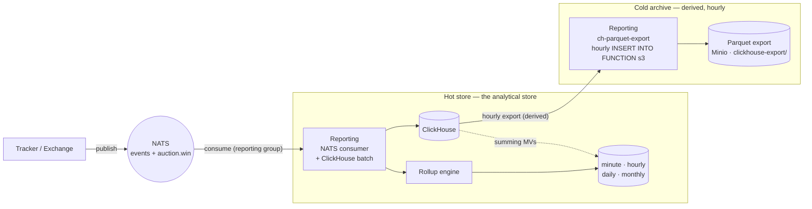
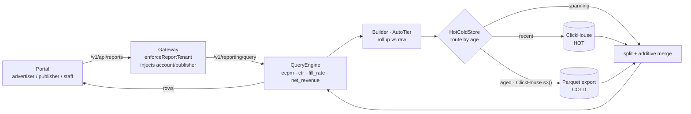

# Data & reporting — single write + derived cold export + hot/cold read path

How an event becomes a number on a dashboard: **written once** to ClickHouse (the
single analytical store) from the NATS stream, exported hourly to a derived
Parquet cold archive, then read back server-side through the metrics engine and
the hot/cold router.

See also: [`e2e-trace`](e2e-trace.md) (the full request),
[`architecture`](architecture.svg) (the map).

## Write path — one stream, one store, a derived hourly export (ADR 0006)

## Read path — server-side, tenant-scoped, hot/cold merged

## What to notice

- **Single write, derived cold archive** — reporting → ClickHouse (hot) is the
  only NATS-driven write; the cold Parquet archive is exported *from* ClickHouse
  hourly (the `ch-parquet-export` chain step), not a second live writer.
  `hot_window` is a read-routing boundary only.
- **All business math is server-side** — the `QueryEngine` computes
  ecpm/ctr/fill_rate/net_revenue; the portal only renders (no browser math).
- **Tenant scope is injected at the gateway** (`enforceReportTenant`) and rides
  through *every* sub-query the engine issues — the isolation invariant.
- **Rollups are transparent** — `AutoTier` serves pre-aggregated rows when the
  range/metrics allow, else falls back to raw; correctness never depends on them.
- **Cold reads use ClickHouse `s3()`** over the derived Parquet export;
  `cold_store_enabled` gates it, off → hot-only.
