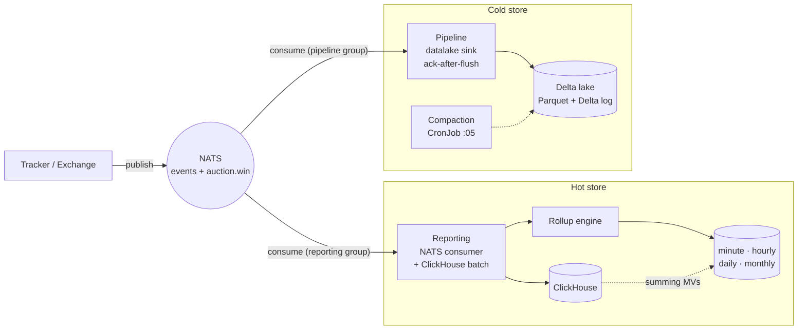
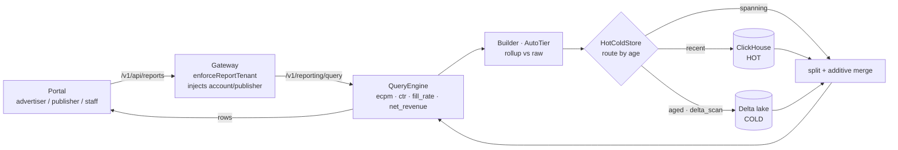

# Data & reporting — dual-write + hot/cold read path

How an event becomes a number on a dashboard: **dual-written** to the hot store
(ClickHouse) and the cold store (Delta lake) from the same NATS stream, then read
back server-side through the metrics engine and the hot/cold router.

See also: [`e2e-trace`](e2e-trace.md) (the full request), [`data-pipeline`](data-pipeline.svg)
(the lake internals), [`architecture`](architecture.svg) (the map).

## Write path — one stream, two stores (independent NATS groups)

## Read path — server-side, tenant-scoped, hot/cold merged

## What to notice

- **Dual-write, not a mover** — reporting → ClickHouse (hot), pipeline → lake
  (cold), both from the *same* events via *independent* NATS consumer groups. No
  scheduled hot→cold copy; `hot_window` is a read-routing boundary only.
- **All business math is server-side** — the `QueryEngine` computes
  ecpm/ctr/fill_rate/net_revenue; the portal only renders (no browser math).
- **Tenant scope is injected at the gateway** (`enforceReportTenant`) and rides
  through *every* sub-query the engine issues — the isolation invariant.
- **Rollups are transparent** — `AutoTier` serves pre-aggregated rows when the
  range/metrics allow, else falls back to raw; correctness never depends on them.
- **Cold reads use `delta_scan`** over the real Delta log (the lake is a genuine
  Delta table); `cold_store_enabled` + the duckdb build tag gate it, off → hot-only.
