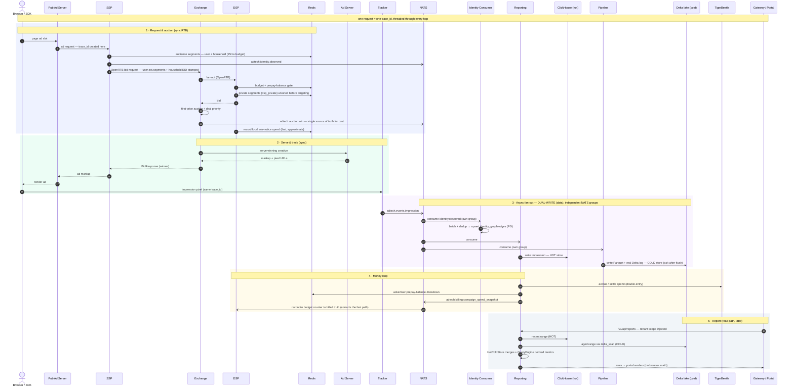

# E2E trace — one ad request across all planes

The platform's north star: *trace any ad request end-to-end with zero data
slippage.* This is that trace — **one `trace_id`**, created at the SSP and
threaded through every hop (HTTP `X-Trace-Id` / W3C `traceparent` / NATS message
header), across all five planes: **serving → async/events → data → money →
control**.

Renders on GitHub. For the structural map see [`architecture`](architecture.svg);
for the index + legend see [`README`](README.md).

## What to notice (the invariants)

- **`trace_id` is the spine** — one value from the SSP through serving, NATS,
  logs, the analytics store, and the billing ledger. It's the OTel W3C trace ID;
  Grafana pivots Loki↔Jaeger on it.
- **`adtech.auction.win` is the single source of truth for cost** — billing and
  reporting both derive from it, not from independent guesses.
- **Dual-write, not a mover (§3)** — reporting writes ClickHouse (hot) and the
  pipeline writes the Delta lake (cold) from the *same* event stream, via
  independent NATS consumer groups. Nothing copies hot→cold on a schedule.
- **Money is fast-then-correct (§1, §4)** — the DSP paces on a local win-notice
  in Redis (instant, approximate), and later reconciles to the billing ledger's
  committed-spend snapshot (authoritative). See `billing-flow`.
- **The lake never loses events (§3)** — the sink acks NATS *after* a durable
  flush (at-least-once); a crash redelivers instead of dropping.
- **Reads route by age (§5)** — recent → ClickHouse, aged → lake via
  `delta_scan`, spanning ranges merged; tenant scope is injected at the gateway
  and rides through every sub-query.
- **Targeting data is read-only on the hot path (§1)** — segment lookups hit
  Redis inside a 25ms budget and degrade to "no segments", never blocking the
  bid; identity-graph *writes* happen off-path via the identity consumer (§3).
  How that data gets built and loaded: see `targeting-data-flow`.
