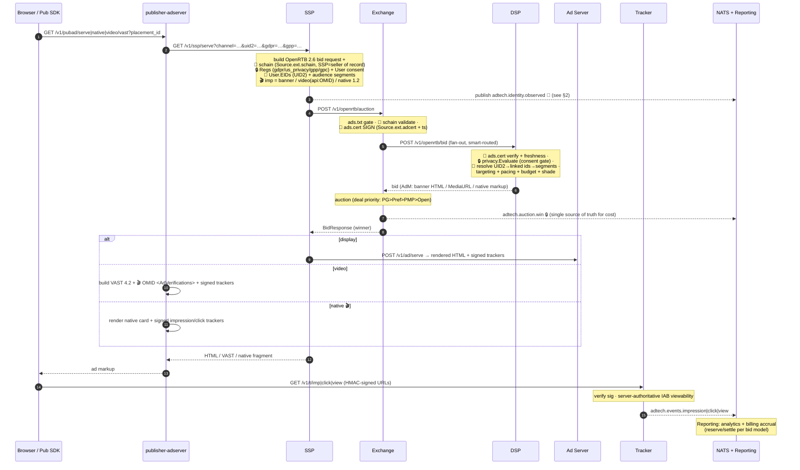
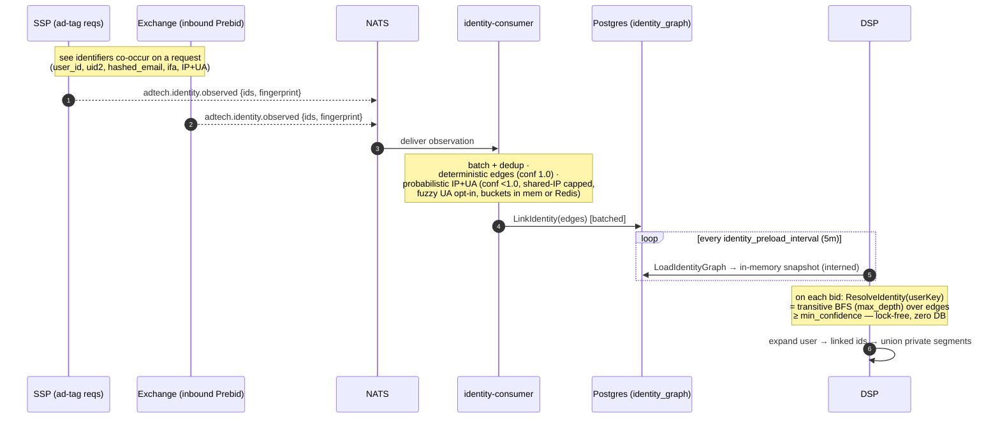

# End-to-End Flow — full ad lifecycle + standards overlays

**Current as of 2026-07-06.** The single "how everything flows" reference:
one ad request from the user's browser all the way through auction, serve,
tracking, billing — annotated with the transparency/trust, privacy, format, and
identity standards layered on top. Companion to `architecture.d2` (static
topology) and `request-flow.txt` (ASCII entry-point map).

Legend for the standards annotations: 🔗 supply-chain/trust · 🔒 privacy ·
🎯 identity · 🎬 format.

## 1. Ad request → auction → serve → track

## 2. Identity subsystem (auto-build → resolve)

Identity is decoupled: many services *observe* cheaply and publish; one consumer
*writes*; the DSP *resolves* from an in-memory snapshot on the hot path.

## What each standard adds (pointer)

| Layer | Standard | Where |
|---|---|---|
| 🔗 Trust | ads.txt · app-ads.txt · sellers.json · schain · **ads.cert** (sign+ts+key dist) | `pkg/fraud`, `cmd/adstxt`/`appadstxt`, `cmd/gateway/sellers.go`, `pkg/openrtb/schain.go`, `pkg/adcert` |
| 🔒 Privacy | TCF · USP · GDPR/CCPA/COPPA · GPC · GPP | `pkg/privacy` (`Signals`, `gpp.go`), SSP `applyPrivacySignals`, DSP `Evaluate` |
| 🎯 Identity | UID2 (`User.EIDs`) · identity graph (observe→consume→resolve) | `pkg/openrtb/eid.go`, `pkg/identityobserve`, `cmd/identity-consumer`, DSP `cmd/dsp/identity.go` |
| 🎬 Formats | OpenRTB Native 1.2 · VAST 4.2 + OMID | `pkg/native`, `pkg/vast`, `cmd/publisher-adserver` |
| Classification | IAB Content Taxonomy 1.0 | `pkg/taxonomy` |

See `docs/STANDARDS.md` for per-standard status and the change log.

