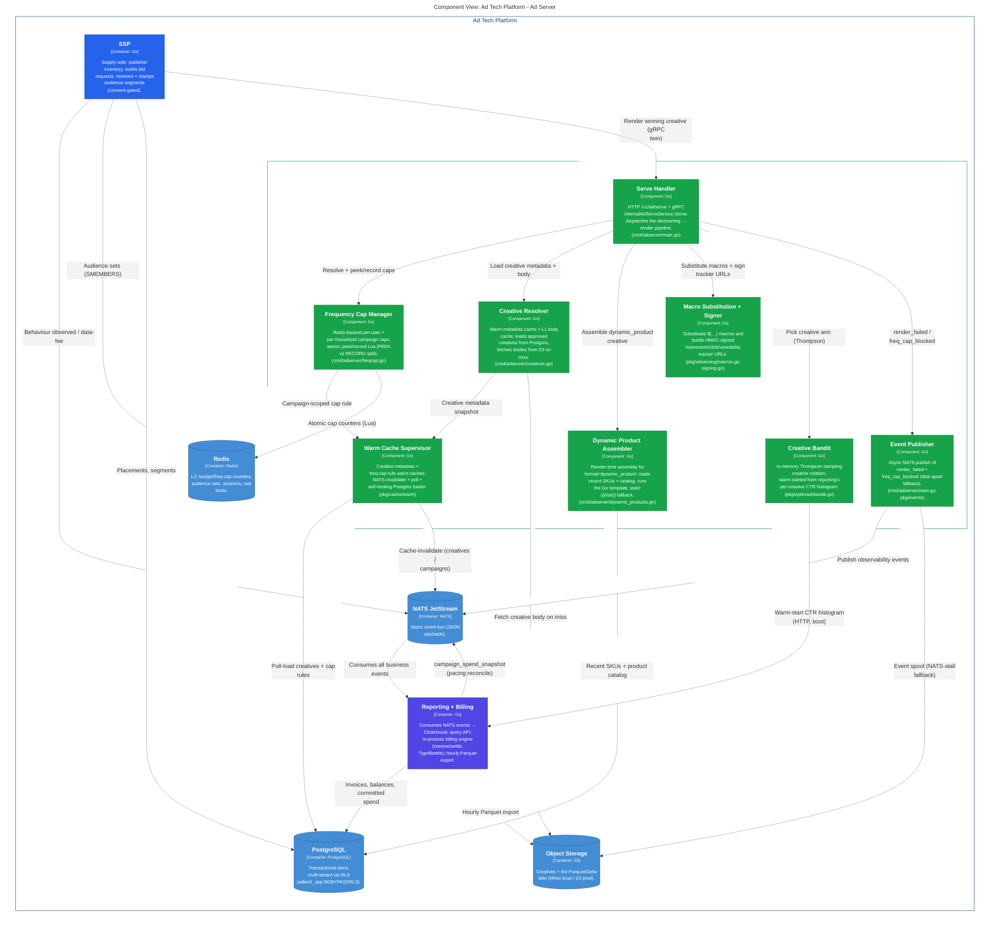

```mermaid
graph LR
  linkStyle default fill:#ffffff

  subgraph diagram ["Component View: Ad Tech Platform - Ad Server"]
    style diagram fill:#ffffff,stroke:#ffffff

    subgraph 9 ["Ad Tech Platform"]
      style 9 fill:#ffffff,stroke:#0b4884,color:#0b4884

      subgraph 44 ["Ad Server"]
        style 44 fill:#ffffff,stroke:#12863d,color:#12863d

        45["<div style='font-weight: bold'>Serve Handler</div><div style='font-size: 70%; margin-top: 0px'>[Component: Go]</div><div style='font-size: 80%; margin-top:10px'>HTTP /v1/ad/serve + gRPC<br />InternalAdServeService.Serve:<br />dispatches the decisioning →<br />render pipeline.<br />(cmd/adserver/main.go)</div>"]
        style 45 fill:#16a34a,stroke:#12863d,color:#ffffff
        46["<div style='font-weight: bold'>Frequency Cap Manager</div><div style='font-size: 70%; margin-top: 0px'>[Component: Go]</div><div style='font-size: 80%; margin-top:10px'>Redis-backed per-user +<br />per-household campaign caps,<br />atomic peek/record Lua (PEEK<br />vs RECORD split).<br />(cmd/adserver/freqcap.go)</div>"]
        style 46 fill:#16a34a,stroke:#12863d,color:#ffffff
        47["<div style='font-weight: bold'>Creative Resolver</div><div style='font-size: 70%; margin-top: 0px'>[Component: Go]</div><div style='font-size: 80%; margin-top:10px'>Warm metadata cache + L1 body<br />cache; loads approved<br />creatives from Postgres,<br />fetches bodies from S3 on<br />miss.<br />(cmd/adserver/creatives.go)</div>"]
        style 47 fill:#16a34a,stroke:#12863d,color:#ffffff
        48["<div style='font-weight: bold'>Macro Substitution + Signer</div><div style='font-size: 70%; margin-top: 0px'>[Component: Go]</div><div style='font-size: 80%; margin-top:10px'>Substitutes ${…} macros and<br />builds HMAC-signed<br />impression/click/viewability<br />tracker URLs.<br />(pkg/adserving/macros.go,<br />signing.go)</div>"]
        style 48 fill:#16a34a,stroke:#12863d,color:#ffffff
        49["<div style='font-weight: bold'>Dynamic Product Assembler</div><div style='font-size: 70%; margin-top: 0px'>[Component: Go]</div><div style='font-size: 80%; margin-top:10px'>Render-time assembly for<br />format=dynamic_product: reads<br />recent SKUs + catalog, runs<br />the Go template, static<br />{{else}} fallback.<br />(cmd/adserver/dynamic_products.go)</div>"]
        style 49 fill:#16a34a,stroke:#12863d,color:#ffffff
        50["<div style='font-weight: bold'>Creative Bandit</div><div style='font-size: 70%; margin-top: 0px'>[Component: Go]</div><div style='font-size: 80%; margin-top:10px'>In-memory Thompson-sampling<br />creative rotation,<br />warm-started from reporting's<br />per-creative CTR histogram.<br />(pkg/optimise/bandit.go)</div>"]
        style 50 fill:#16a34a,stroke:#12863d,color:#ffffff
        51["<div style='font-weight: bold'>Warm Cache Supervisor</div><div style='font-size: 70%; margin-top: 0px'>[Component: Go]</div><div style='font-size: 80%; margin-top:10px'>Creative-metadata +<br />freq-cap-rule warm caches:<br />NATS-invalidate + poll +<br />self-healing Postgres loader.<br />(pkg/cache/warm)</div>"]
        style 51 fill:#16a34a,stroke:#12863d,color:#ffffff
        52["<div style='font-weight: bold'>Event Publisher</div><div style='font-size: 70%; margin-top: 0px'>[Component: Go]</div><div style='font-size: 80%; margin-top:10px'>Async NATS publish of<br />render_failed +<br />freq_cap_blocked (disk-spool<br />fallback).<br />(cmd/adserver/main.go,<br />pkg/events)</div>"]
        style 52 fill:#16a34a,stroke:#12863d,color:#ffffff
      end

      145[("<div style='font-weight: bold'>PostgreSQL</div><div style='font-size: 70%; margin-top: 0px'>[Container: PostgreSQL]</div><div style='font-size: 80%; margin-top:10px'>Transactional store,<br />multi-tenant via RLS<br />(adtech_app NOBYPASSRLS).</div>")]
      style 145 fill:#438dd5,stroke:#2e6295,color:#ffffff
      146[("<div style='font-weight: bold'>Redis</div><div style='font-size: 70%; margin-top: 0px'>[Container: Redis]</div><div style='font-size: 80%; margin-top:10px'>L2: budget/freq-cap counters,<br />audience sets, sessions, rate<br />limits.</div>")]
      style 146 fill:#438dd5,stroke:#2e6295,color:#ffffff
      148[("<div style='font-weight: bold'>NATS JetStream</div><div style='font-size: 70%; margin-top: 0px'>[Container: NATS]</div><div style='font-size: 80%; margin-top:10px'>Async event bus (JSON<br />payloads).</div>")]
      style 148 fill:#438dd5,stroke:#2e6295,color:#ffffff
      149[("<div style='font-weight: bold'>Object Storage</div><div style='font-size: 70%; margin-top: 0px'>[Container: S3]</div><div style='font-size: 80%; margin-top:10px'>Creatives + the Parquet/Delta<br />lake (Minio local / S3 prod).</div>")]
      style 149 fill:#438dd5,stroke:#2e6295,color:#ffffff
      18["<div style='font-weight: bold'>SSP</div><div style='font-size: 70%; margin-top: 0px'>[Container: Go]</div><div style='font-size: 80%; margin-top:10px'>Supply-side: publisher<br />inventory, builds bid<br />requests, resolves + stamps<br />audience segments<br />(consent-gated).</div>"]
      style 18 fill:#2563eb,stroke:#1e4fc2,color:#ffffff
      85["<div style='font-weight: bold'>Reporting + Billing</div><div style='font-size: 70%; margin-top: 0px'>[Container: Go]</div><div style='font-size: 80%; margin-top:10px'>Consumes NATS events →<br />ClickHouse; query API;<br />in-process billing engine<br />(reserve/settle,<br />TigerBeetle); hourly Parquet<br />export.</div>"]
      style 85 fill:#4f46e5,stroke:#413abd,color:#ffffff
    end

    18-. "<div>Behaviour observed / data-fee</div><div style='font-size: 70%'></div>" .->148
    148-. "<div>Consumes all business events</div><div style='font-size: 70%'></div>" .->85
    85-. "<div>Invoices, balances, committed<br />spend</div><div style='font-size: 70%'></div>" .->145
    85-. "<div>Hourly Parquet export</div><div style='font-size: 70%'></div>" .->149
    85-. "<div>campaign_spend_snapshot<br />(pacing reconcile)</div><div style='font-size: 70%'></div>" .->148
    18-. "<div>Audience sets (SMEMBERS)</div><div style='font-size: 70%'></div>" .->146
    18-. "<div>Placements, segments</div><div style='font-size: 70%'></div>" .->145
    45-. "<div>Resolve + peek/record caps</div><div style='font-size: 70%'></div>" .->46
    45-. "<div>Load creative metadata + body</div><div style='font-size: 70%'></div>" .->47
    45-. "<div>Assemble dynamic_product<br />creative</div><div style='font-size: 70%'></div>" .->49
    45-. "<div>Substitute macros + sign<br />tracker URLs</div><div style='font-size: 70%'></div>" .->48
    45-. "<div>Pick creative arm (Thompson)</div><div style='font-size: 70%'></div>" .->50
    45-. "<div>render_failed /<br />freq_cap_blocked</div><div style='font-size: 70%'></div>" .->52
    46-. "<div>Campaign-scoped cap rule</div><div style='font-size: 70%'></div>" .->51
    47-. "<div>Creative metadata snapshot</div><div style='font-size: 70%'></div>" .->51
    46-. "<div>Atomic cap counters (Lua)</div><div style='font-size: 70%'></div>" .->146
    47-. "<div>Fetch creative body on miss</div><div style='font-size: 70%'></div>" .->149
    49-. "<div>Recent SKUs + product catalog</div><div style='font-size: 70%'></div>" .->145
    51-. "<div>Poll-load creatives + cap<br />rules</div><div style='font-size: 70%'></div>" .->145
    51-. "<div>Cache-invalidate (creatives /<br />campaigns)</div><div style='font-size: 70%'></div>" .->148
    52-. "<div>Publish observability events</div><div style='font-size: 70%'></div>" .->148
    52-. "<div>Event spool (NATS-stall<br />fallback)</div><div style='font-size: 70%'></div>" .->149
    18-. "<div>Render winning creative (gRPC<br />twin)</div><div style='font-size: 70%'></div>" .->45
    50-. "<div>Warm-start CTR histogram<br />(HTTP, boot)</div><div style='font-size: 70%'></div>" .->85

  end
```
