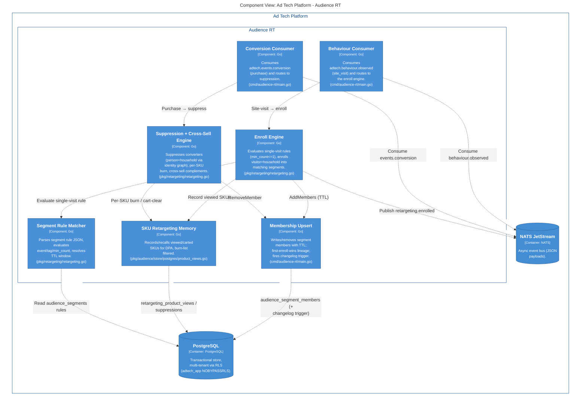

```mermaid
graph LR
  linkStyle default fill:#ffffff

  subgraph diagram ["Component View: Ad Tech Platform - Audience RT"]
    style diagram fill:#ffffff,stroke:#ffffff

    subgraph 9 ["Ad Tech Platform"]
      style 9 fill:#ffffff,stroke:#0b4884,color:#0b4884

      subgraph 107 ["Audience RT"]
        style 107 fill:#ffffff,stroke:#0b4884,color:#0b4884

        108["<div style='font-weight: bold'>Behaviour Consumer</div><div style='font-size: 70%; margin-top: 0px'>[Component: Go]</div><div style='font-size: 80%; margin-top:10px'>Consumes<br />adtech.behaviour.observed<br />(site_visit) and routes to<br />the enroll engine.<br />(cmd/audience-rt/main.go)</div>"]
        style 108 fill:#4a90d9,stroke:#336497,color:#ffffff
        109["<div style='font-weight: bold'>Conversion Consumer</div><div style='font-size: 70%; margin-top: 0px'>[Component: Go]</div><div style='font-size: 80%; margin-top:10px'>Consumes<br />adtech.events.conversion<br />(purchase) and routes to<br />suppression.<br />(cmd/audience-rt/main.go)</div>"]
        style 109 fill:#4a90d9,stroke:#336497,color:#ffffff
        110["<div style='font-weight: bold'>Enroll Engine</div><div style='font-size: 70%; margin-top: 0px'>[Component: Go]</div><div style='font-size: 80%; margin-top:10px'>Evaluates single-visit rules<br />(min_count<=1), enrolls<br />visitor+household into<br />matching segments.<br />(pkg/retargeting/retargeting.go)</div>"]
        style 110 fill:#4a90d9,stroke:#336497,color:#ffffff
        111["<div style='font-weight: bold'>Suppression + Cross-Sell Engine</div><div style='font-size: 70%; margin-top: 0px'>[Component: Go]</div><div style='font-size: 80%; margin-top:10px'>Suppresses converters<br />(person+household via<br />identity graph), per-SKU<br />burn, cross-sell complements.<br />(pkg/retargeting/retargeting.go)</div>"]
        style 111 fill:#4a90d9,stroke:#336497,color:#ffffff
        112["<div style='font-weight: bold'>Segment Rule Matcher</div><div style='font-size: 70%; margin-top: 0px'>[Component: Go]</div><div style='font-size: 80%; margin-top:10px'>Parses segment rule JSON,<br />evaluates<br />event/tag/min_count, resolves<br />TTL window.<br />(pkg/retargeting/retargeting.go)</div>"]
        style 112 fill:#4a90d9,stroke:#336497,color:#ffffff
        113["<div style='font-weight: bold'>SKU Retargeting Memory</div><div style='font-size: 70%; margin-top: 0px'>[Component: Go]</div><div style='font-size: 80%; margin-top:10px'>Records/recalls viewed/carted<br />SKUs for DPA, burn-list<br />filtered.<br />(pkg/audience/store/postgres/product_views.go)</div>"]
        style 113 fill:#4a90d9,stroke:#336497,color:#ffffff
        114["<div style='font-weight: bold'>Membership Upsert</div><div style='font-size: 70%; margin-top: 0px'>[Component: Go]</div><div style='font-size: 80%; margin-top:10px'>Writes/removes segment<br />members with TTL;<br />first-enroll-wins lineage;<br />fires changelog trigger.<br />(cmd/audience-rt/main.go)</div>"]
        style 114 fill:#4a90d9,stroke:#336497,color:#ffffff
      end

      145[("<div style='font-weight: bold'>PostgreSQL</div><div style='font-size: 70%; margin-top: 0px'>[Container: PostgreSQL]</div><div style='font-size: 80%; margin-top:10px'>Transactional store,<br />multi-tenant via RLS<br />(adtech_app NOBYPASSRLS).</div>")]
      style 145 fill:#438dd5,stroke:#2e6295,color:#ffffff
      148[("<div style='font-weight: bold'>NATS JetStream</div><div style='font-size: 70%; margin-top: 0px'>[Container: NATS]</div><div style='font-size: 80%; margin-top:10px'>Async event bus (JSON<br />payloads).</div>")]
      style 148 fill:#438dd5,stroke:#2e6295,color:#ffffff
    end

    108-. "<div>Consume behaviour.observed</div><div style='font-size: 70%'></div>" .->148
    109-. "<div>Consume events.conversion</div><div style='font-size: 70%'></div>" .->148
    108-. "<div>Site-visit → enroll</div><div style='font-size: 70%'></div>" .->110
    109-. "<div>Purchase → suppress</div><div style='font-size: 70%'></div>" .->111
    110-. "<div>Evaluate single-visit rule</div><div style='font-size: 70%'></div>" .->112
    110-. "<div>Record viewed SKUs</div><div style='font-size: 70%'></div>" .->113
    110-. "<div>AddMembers (TTL)</div><div style='font-size: 70%'></div>" .->114
    111-. "<div>RemoveMember</div><div style='font-size: 70%'></div>" .->114
    111-. "<div>Per-SKU burn / cart-clear</div><div style='font-size: 70%'></div>" .->113
    110-. "<div>Publish retargeting.enrolled</div><div style='font-size: 70%'></div>" .->148
    114-. "<div>audience_segment_members (+<br />changelog trigger)</div><div style='font-size: 70%'></div>" .->145
    113-. "<div>retargeting_product_views /<br />suppressions</div><div style='font-size: 70%'></div>" .->145
    112-. "<div>Read audience_segments rules</div><div style='font-size: 70%'></div>" .->145

  end
```
