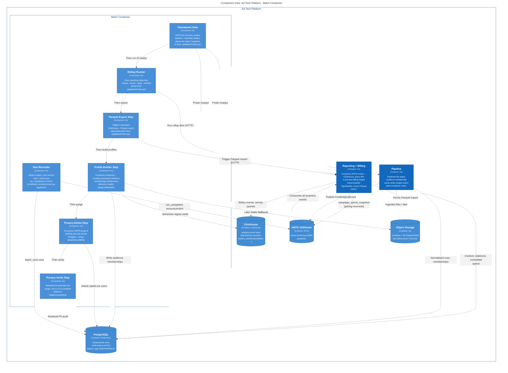

```mermaid
graph LR
  linkStyle default fill:#ffffff

  subgraph diagram ["Component View: Ad Tech Platform - Batch Conductor"]
    style diagram fill:#ffffff,stroke:#ffffff

    subgraph 9 ["Ad Tech Platform"]
      style 9 fill:#ffffff,stroke:#0b4884,color:#0b4884

      subgraph 137 ["Batch Conductor"]
        style 137 fill:#ffffff,stroke:#0b4884,color:#0b4884

        138["<div style='font-weight: bold'>Checkpoint Gate</div><div style='font-size: 70%; margin-top: 0px'>[Component: Go]</div><div style='font-size: 80%; margin-top:10px'>CRITICAL first step: probes<br />pipeline + reporting /readyz;<br />aborts the chain if ingestion<br />is down. (pkg/batch/chain.go)</div>"]
        style 138 fill:#4a90d9,stroke:#336497,color:#ffffff
        139["<div style='font-weight: bold'>Rollup Runner</div><div style='font-size: 70%; margin-top: 0px'>[Component: Go]</div><div style='font-size: 80%; margin-top:10px'>Runs reporting rollup tiers<br />minute→hourly→daily→monthly<br />(finest first).<br />(pkg/batch/chain.go)</div>"]
        style 139 fill:#4a90d9,stroke:#336497,color:#ffffff
        140["<div style='font-weight: bold'>Parquet Export Step</div><div style='font-size: 70%; margin-top: 0px'>[Component: Go]</div><div style='font-size: 80%; margin-top:10px'>Triggers reporting's<br />ClickHouse→Parquet export<br />(idempotent per hour).<br />(pkg/batch/chain.go)</div>"]
        style 140 fill:#4a90d9,stroke:#336497,color:#ffffff
        141["<div style='font-weight: bold'>Profile-Builder Step</div><div style='font-size: 70%; margin-top: 0px'>[Component: Go]</div><div style='font-size: 80%; margin-top:10px'>In-process clustering →<br />enroll/prune/expand audience<br />memberships (ClickHouse<br />behaviour reads).<br />(pkg/profilebuilder)</div>"]
        style 141 fill:#4a90d9,stroke:#336497,color:#ffffff
        142["<div style='font-weight: bold'>Privacy-Delete Step</div><div style='font-size: 70%; margin-top: 0px'>[Component: Go]</div><div style='font-size: 80%; margin-top:10px'>In-process GDPR purge of<br />pending opt-outs across<br />Postgres + extras.<br />(pkg/privacydelete)</div>"]
        style 142 fill:#4a90d9,stroke:#336497,color:#ffffff
        143["<div style='font-weight: bold'>Privacy-Verify Step</div><div style='font-size: 70%; margin-top: 0px'>[Component: Go]</div><div style='font-size: 80%; margin-top:10px'>Residual-PII audit after the<br />purge; red run on incomplete<br />deletions.<br />(pkg/privacydelete)</div>"]
        style 143 fill:#4a90d9,stroke:#336497,color:#ffffff
        144["<div style='font-weight: bold'>Run Recorder</div><div style='font-size: 70%; margin-top: 0px'>[Component: Go]</div><div style='font-size: 80%; margin-top:10px'>Writes a batch_runs row per<br />step + announces<br />run_completed on NATS.<br />(cmd/batch-conductor/main.go,<br />pkg/batch)</div>"]
        style 144 fill:#4a90d9,stroke:#336497,color:#ffffff
      end

      145[("<div style='font-weight: bold'>PostgreSQL</div><div style='font-size: 70%; margin-top: 0px'>[Container: PostgreSQL]</div><div style='font-size: 80%; margin-top:10px'>Transactional store,<br />multi-tenant via RLS<br />(adtech_app NOBYPASSRLS).</div>")]
      style 145 fill:#438dd5,stroke:#2e6295,color:#ffffff
      147[("<div style='font-weight: bold'>ClickHouse</div><div style='font-size: 70%; margin-top: 0px'>[Container: ClickHouse]</div><div style='font-size: 80%; margin-top:10px'>Analytics event store<br />(impressions, auctions,<br />auction_wins/losses/shades,<br />…).</div>")]
      style 147 fill:#438dd5,stroke:#2e6295,color:#ffffff
      148[("<div style='font-weight: bold'>NATS JetStream</div><div style='font-size: 70%; margin-top: 0px'>[Container: NATS]</div><div style='font-size: 80%; margin-top:10px'>Async event bus (JSON<br />payloads).</div>")]
      style 148 fill:#438dd5,stroke:#2e6295,color:#ffffff
      149[("<div style='font-weight: bold'>Object Storage</div><div style='font-size: 70%; margin-top: 0px'>[Container: S3]</div><div style='font-size: 80%; margin-top:10px'>Creatives + the Parquet/Delta<br />lake (Minio local / S3 prod).</div>")]
      style 149 fill:#438dd5,stroke:#2e6295,color:#ffffff
      85["<div style='font-weight: bold'>Reporting + Billing</div><div style='font-size: 70%; margin-top: 0px'>[Container: Go]</div><div style='font-size: 80%; margin-top:10px'>Consumes NATS events →<br />ClickHouse; query API;<br />in-process billing engine<br />(reserve/settle,<br />TigerBeetle); hourly Parquet<br />export.</div>"]
      style 85 fill:#1168bd,stroke:#0b4884,color:#ffffff
      94["<div style='font-weight: bold'>Pipeline</div><div style='font-size: 70%; margin-top: 0px'>[Container: Go]</div><div style='font-size: 80%; margin-top:10px'>Publisher-file ingest,<br />audience membership<br />cache-writer (single writer),<br />batch-conductor chain.</div>"]
      style 94 fill:#1168bd,stroke:#0b4884,color:#ffffff
    end

    148-. "<div>Consumes all business events</div><div style='font-size: 70%'></div>" .->85
    85-. "<div>Writes events; serves queries</div><div style='font-size: 70%'></div>" .->147
    85-. "<div>Invoices, balances, committed<br />spend</div><div style='font-size: 70%'></div>" .->145
    85-. "<div>Hourly Parquet export</div><div style='font-size: 70%'></div>" .->149
    85-. "<div>campaign_spend_snapshot<br />(pacing reconcile)</div><div style='font-size: 70%'></div>" .->148
    94-. "<div>Ingested files / lake</div><div style='font-size: 70%'></div>" .->149
    94-. "<div>Normalised rows, memberships</div><div style='font-size: 70%'></div>" .->145
    94-. "<div>Publish ProfileSignalEvent</div><div style='font-size: 70%'></div>" .->148
    138-. "<div>Probe /readyz</div><div style='font-size: 70%'></div>" .->94
    138-. "<div>Probe /readyz</div><div style='font-size: 70%'></div>" .->85
    138-. "<div>Then run (if ready)</div><div style='font-size: 70%'></div>" .->139
    139-. "<div>Run rollup tiers (HTTP)</div><div style='font-size: 70%'></div>" .->85
    139-. "<div>Then export</div><div style='font-size: 70%'></div>" .->140
    140-. "<div>Trigger Parquet export (HTTP)</div><div style='font-size: 70%'></div>" .->85
    140-. "<div>Then build profiles</div><div style='font-size: 70%'></div>" .->141
    141-. "<div>Write audience memberships</div><div style='font-size: 70%'></div>" .->145
    141-. "<div>Behaviour signal reads</div><div style='font-size: 70%'></div>" .->147
    141-. "<div>Lake reads (fallback)</div><div style='font-size: 70%'></div>" .->149
    141-. "<div>Then purge</div><div style='font-size: 70%'></div>" .->142
    142-. "<div>Delete opted-out users</div><div style='font-size: 70%'></div>" .->145
    142-. "<div>Then verify</div><div style='font-size: 70%'></div>" .->143
    143-. "<div>Residual-PII audit</div><div style='font-size: 70%'></div>" .->145
    144-. "<div>batch_runs rows</div><div style='font-size: 70%'></div>" .->145
    144-. "<div>run_completed announcement</div><div style='font-size: 70%'></div>" .->148

  end
```
