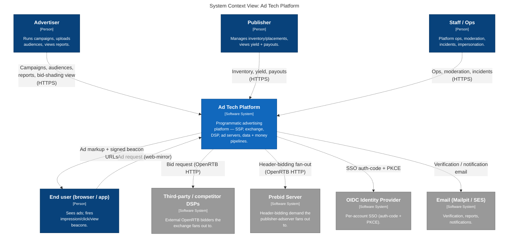

```mermaid
graph LR
  linkStyle default fill:#ffffff

  subgraph diagram ["System Context View: Ad Tech Platform"]
    style diagram fill:#ffffff,stroke:#ffffff

    1["<div style='font-weight: bold'>Advertiser</div><div style='font-size: 70%; margin-top: 0px'>[Person]</div><div style='font-size: 80%; margin-top:10px'>Runs campaigns, uploads<br />audiences, views reports.</div>"]
    style 1 fill:#08427b,stroke:#052e56,color:#ffffff
    2["<div style='font-weight: bold'>Publisher</div><div style='font-size: 70%; margin-top: 0px'>[Person]</div><div style='font-size: 80%; margin-top:10px'>Manages inventory/placements,<br />views yield + payouts.</div>"]
    style 2 fill:#08427b,stroke:#052e56,color:#ffffff
    3["<div style='font-weight: bold'>Staff / Ops</div><div style='font-size: 70%; margin-top: 0px'>[Person]</div><div style='font-size: 80%; margin-top:10px'>Platform ops, moderation,<br />incidents, impersonation.</div>"]
    style 3 fill:#08427b,stroke:#052e56,color:#ffffff
    4["<div style='font-weight: bold'>End user (browser / app)</div><div style='font-size: 70%; margin-top: 0px'>[Person]</div><div style='font-size: 80%; margin-top:10px'>Sees ads; fires<br />impression/click/view<br />beacons.</div>"]
    style 4 fill:#08427b,stroke:#052e56,color:#ffffff
    5["<div style='font-weight: bold'>Third-party / competitor DSPs</div><div style='font-size: 70%; margin-top: 0px'>[Software System]</div><div style='font-size: 80%; margin-top:10px'>External OpenRTB bidders the<br />exchange fans out to.</div>"]
    style 5 fill:#999999,stroke:#6b6b6b,color:#ffffff
    6["<div style='font-weight: bold'>Prebid Server</div><div style='font-size: 70%; margin-top: 0px'>[Software System]</div><div style='font-size: 80%; margin-top:10px'>Header-bidding demand the<br />publisher-adserver fans out<br />to.</div>"]
    style 6 fill:#999999,stroke:#6b6b6b,color:#ffffff
    7["<div style='font-weight: bold'>OIDC Identity Provider</div><div style='font-size: 70%; margin-top: 0px'>[Software System]</div><div style='font-size: 80%; margin-top:10px'>Per-account SSO (auth-code +<br />PKCE).</div>"]
    style 7 fill:#999999,stroke:#6b6b6b,color:#ffffff
    8["<div style='font-weight: bold'>Email (Mailpit / SES)</div><div style='font-size: 70%; margin-top: 0px'>[Software System]</div><div style='font-size: 80%; margin-top:10px'>Verification, reports,<br />notifications.</div>"]
    style 8 fill:#999999,stroke:#6b6b6b,color:#ffffff
    9["<div style='font-weight: bold'>Ad Tech Platform</div><div style='font-size: 70%; margin-top: 0px'>[Software System]</div><div style='font-size: 80%; margin-top:10px'>Programmatic advertising<br />platform — SSP, exchange,<br />DSP, ad servers, data + money<br />pipelines.</div>"]
    style 9 fill:#1168bd,stroke:#0b4884,color:#ffffff

    1-. "<div>Campaigns, audiences,<br />reports, bid-shading view<br />(HTTPS)</div><div style='font-size: 70%'></div>" .->9
    2-. "<div>Inventory, yield, payouts<br />(HTTPS)</div><div style='font-size: 70%'></div>" .->9
    3-. "<div>Ops, moderation, incidents<br />(HTTPS)</div><div style='font-size: 70%'></div>" .->9
    9-. "<div>SSO auth-code + PKCE</div><div style='font-size: 70%'></div>" .->7
    9-. "<div>Verification / notification<br />email</div><div style='font-size: 70%'></div>" .->8
    4-. "<div>Ad request (web-mirror)</div><div style='font-size: 70%'></div>" .->9
    9-. "<div>Header-bidding fan-out<br />(OpenRTB HTTP)</div><div style='font-size: 70%'></div>" .->6
    9-. "<div>Bid request (OpenRTB HTTP)</div><div style='font-size: 70%'></div>" .->5
    9-. "<div>Ad markup + signed beacon<br />URLs</div><div style='font-size: 70%'></div>" .->4

  end
```
