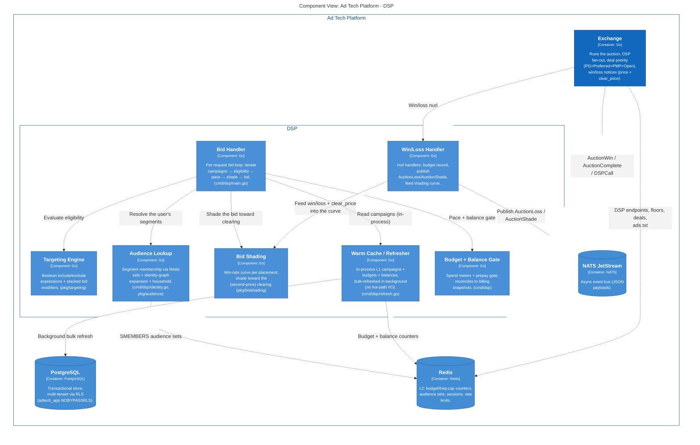

```mermaid
graph LR
  linkStyle default fill:#ffffff

  subgraph diagram ["Component View: Ad Tech Platform - DSP"]
    style diagram fill:#ffffff,stroke:#ffffff

    subgraph 9 ["Ad Tech Platform"]
      style 9 fill:#ffffff,stroke:#0b4884,color:#0b4884

      subgraph 36 ["DSP"]
        style 36 fill:#ffffff,stroke:#0b4884,color:#0b4884

        37["<div style='font-weight: bold'>Bid Handler</div><div style='font-size: 70%; margin-top: 0px'>[Component: Go]</div><div style='font-size: 80%; margin-top:10px'>Per-request bid loop: iterate<br />campaigns → eligibility →<br />pace → shade → bid.<br />(cmd/dsp/main.go)</div>"]
        style 37 fill:#4a90d9,stroke:#336497,color:#ffffff
        38["<div style='font-weight: bold'>Targeting Engine</div><div style='font-size: 70%; margin-top: 0px'>[Component: Go]</div><div style='font-size: 80%; margin-top:10px'>Boolean include/exclude<br />expressions + stacked bid<br />modifiers. (pkg/targeting)</div>"]
        style 38 fill:#4a90d9,stroke:#336497,color:#ffffff
        39["<div style='font-weight: bold'>Audience Lookup</div><div style='font-size: 70%; margin-top: 0px'>[Component: Go]</div><div style='font-size: 80%; margin-top:10px'>Segment membership via Redis<br />sets + identity-graph<br />expansion + household.<br />(cmd/dsp/identity.go,<br />pkg/audience)</div>"]
        style 39 fill:#4a90d9,stroke:#336497,color:#ffffff
        40["<div style='font-weight: bold'>Bid Shading</div><div style='font-size: 70%; margin-top: 0px'>[Component: Go]</div><div style='font-size: 80%; margin-top:10px'>Win-rate curve per placement;<br />shade toward the<br />(second-price) clearing.<br />(pkg/bidshading)</div>"]
        style 40 fill:#4a90d9,stroke:#336497,color:#ffffff
        41["<div style='font-weight: bold'>Warm Cache / Refresher</div><div style='font-size: 70%; margin-top: 0px'>[Component: Go]</div><div style='font-size: 80%; margin-top:10px'>In-process L1 campaigns +<br />budgets + balances,<br />bulk-refreshed in background<br />(no hot-path I/O).<br />(cmd/dsp/refresh.go)</div>"]
        style 41 fill:#4a90d9,stroke:#336497,color:#ffffff
        42["<div style='font-weight: bold'>Budget + Balance Gate</div><div style='font-size: 70%; margin-top: 0px'>[Component: Go]</div><div style='font-size: 80%; margin-top:10px'>Spend meters + prepay gate;<br />reconciles to billing<br />snapshots. (cmd/dsp)</div>"]
        style 42 fill:#4a90d9,stroke:#336497,color:#ffffff
        43["<div style='font-weight: bold'>Win/Loss Handler</div><div style='font-size: 70%; margin-top: 0px'>[Component: Go]</div><div style='font-size: 80%; margin-top:10px'>nurl handlers: budget record,<br />publish<br />AuctionLoss/AuctionShade,<br />feed shading curve.</div>"]
        style 43 fill:#4a90d9,stroke:#336497,color:#ffffff
      end

      145[("<div style='font-weight: bold'>PostgreSQL</div><div style='font-size: 70%; margin-top: 0px'>[Container: PostgreSQL]</div><div style='font-size: 80%; margin-top:10px'>Transactional store,<br />multi-tenant via RLS<br />(adtech_app NOBYPASSRLS).</div>")]
      style 145 fill:#438dd5,stroke:#2e6295,color:#ffffff
      146[("<div style='font-weight: bold'>Redis</div><div style='font-size: 70%; margin-top: 0px'>[Container: Redis]</div><div style='font-size: 80%; margin-top:10px'>L2: budget/freq-cap counters,<br />audience sets, sessions, rate<br />limits.</div>")]
      style 146 fill:#438dd5,stroke:#2e6295,color:#ffffff
      148[("<div style='font-weight: bold'>NATS JetStream</div><div style='font-size: 70%; margin-top: 0px'>[Container: NATS]</div><div style='font-size: 80%; margin-top:10px'>Async event bus (JSON<br />payloads).</div>")]
      style 148 fill:#438dd5,stroke:#2e6295,color:#ffffff
      27["<div style='font-weight: bold'>Exchange</div><div style='font-size: 70%; margin-top: 0px'>[Container: Go]</div><div style='font-size: 80%; margin-top:10px'>Runs the auction, DSP<br />fan-out, deal priority<br />(PG>Preferred>PMP>Open),<br />win/loss notices (price +<br />clear_price).</div>"]
      style 27 fill:#1168bd,stroke:#0b4884,color:#ffffff
    end

    27-. "<div>AuctionWin / AuctionComplete<br />/ DSPCall</div><div style='font-size: 70%'></div>" .->148
    37-. "<div>Evaluate eligibility</div><div style='font-size: 70%'></div>" .->38
    37-. "<div>Resolve the user's segments</div><div style='font-size: 70%'></div>" .->39
    37-. "<div>Shade the bid toward clearing</div><div style='font-size: 70%'></div>" .->40
    37-. "<div>Pace + balance gate</div><div style='font-size: 70%'></div>" .->42
    37-. "<div>Read campaigns (in-process)</div><div style='font-size: 70%'></div>" .->41
    39-. "<div>SMEMBERS audience sets</div><div style='font-size: 70%'></div>" .->146
    41-. "<div>Background bulk refresh</div><div style='font-size: 70%'></div>" .->145
    41-. "<div>Budget + balance counters</div><div style='font-size: 70%'></div>" .->146
    43-. "<div>Publish AuctionLoss /<br />AuctionShade</div><div style='font-size: 70%'></div>" .->148
    43-. "<div>Feed win/loss + clear_price<br />into the curve</div><div style='font-size: 70%'></div>" .->40
    27-. "<div>Win/loss nurl</div><div style='font-size: 70%'></div>" .->43
    27-. "<div>DSP endpoints, floors, deals,<br />ads.txt</div><div style='font-size: 70%'></div>" .->146

  end
```
