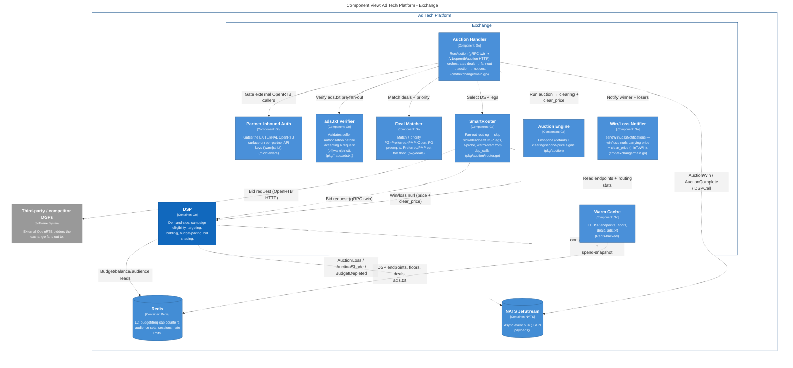

```mermaid
graph LR
  linkStyle default fill:#ffffff

  subgraph diagram ["Component View: Ad Tech Platform - Exchange"]
    style diagram fill:#ffffff,stroke:#ffffff

    5["<div style='font-weight: bold'>Third-party / competitor DSPs</div><div style='font-size: 70%; margin-top: 0px'>[Software System]</div><div style='font-size: 80%; margin-top:10px'>External OpenRTB bidders the<br />exchange fans out to.</div>"]
    style 5 fill:#999999,stroke:#6b6b6b,color:#ffffff

    subgraph 9 ["Ad Tech Platform"]
      style 9 fill:#ffffff,stroke:#0b4884,color:#0b4884

      subgraph 27 ["Exchange"]
        style 27 fill:#ffffff,stroke:#0b4884,color:#0b4884

        28["<div style='font-weight: bold'>Auction Handler</div><div style='font-size: 70%; margin-top: 0px'>[Component: Go]</div><div style='font-size: 80%; margin-top:10px'>RunAuction (gRPC twin +<br />/v1/openrtb/auction HTTP):<br />orchestrates deals → fan-out<br />→ auction → notices.<br />(cmd/exchange/main.go)</div>"]
        style 28 fill:#4a90d9,stroke:#336497,color:#ffffff
        29["<div style='font-weight: bold'>Partner Inbound Auth</div><div style='font-size: 70%; margin-top: 0px'>[Component: Go]</div><div style='font-size: 80%; margin-top:10px'>Gates the EXTERNAL OpenRTB<br />surface on per-partner API<br />keys (warn|strict).<br />(middleware)</div>"]
        style 29 fill:#4a90d9,stroke:#336497,color:#ffffff
        30["<div style='font-weight: bold'>ads.txt Verifier</div><div style='font-size: 70%; margin-top: 0px'>[Component: Go]</div><div style='font-size: 80%; margin-top:10px'>Validates seller<br />authorisation before<br />accepting a request<br />(off|warn|strict).<br />(pkg/fraud/adstxt)</div>"]
        style 30 fill:#4a90d9,stroke:#336497,color:#ffffff
        31["<div style='font-weight: bold'>Deal Matcher</div><div style='font-size: 70%; margin-top: 0px'>[Component: Go]</div><div style='font-size: 80%; margin-top:10px'>Match + priority<br />PG>Preferred>PMP>Open; PG<br />preempts, Preferred/PMP set<br />the floor. (pkg/deals)</div>"]
        style 31 fill:#4a90d9,stroke:#336497,color:#ffffff
        32["<div style='font-weight: bold'>SmartRouter</div><div style='font-size: 70%; margin-top: 0px'>[Component: Go]</div><div style='font-size: 80%; margin-top:10px'>Fan-out routing — skip<br />slow/deadbeat DSP legs,<br />ε-probe, warm-start from<br />dsp_calls.<br />(pkg/auction/router.go)</div>"]
        style 32 fill:#4a90d9,stroke:#336497,color:#ffffff
        33["<div style='font-weight: bold'>Auction Engine</div><div style='font-size: 70%; margin-top: 0px'>[Component: Go]</div><div style='font-size: 80%; margin-top:10px'>First-price (default) +<br />clearing/second-price signal.<br />(pkg/auction)</div>"]
        style 33 fill:#4a90d9,stroke:#336497,color:#ffffff
        34["<div style='font-weight: bold'>Win/Loss Notifier</div><div style='font-size: 70%; margin-top: 0px'>[Component: Go]</div><div style='font-size: 80%; margin-top:10px'>sendWinLossNotifications —<br />win/loss nurls carrying price<br />+ clear_price (minToWin).<br />(cmd/exchange/main.go)</div>"]
        style 34 fill:#4a90d9,stroke:#336497,color:#ffffff
        35["<div style='font-weight: bold'>Warm Cache</div><div style='font-size: 70%; margin-top: 0px'>[Component: Go]</div><div style='font-size: 80%; margin-top:10px'>L1 DSP endpoints, floors,<br />deals, ads.txt<br />(Redis-backed).</div>"]
        style 35 fill:#4a90d9,stroke:#336497,color:#ffffff
      end

      146[("<div style='font-weight: bold'>Redis</div><div style='font-size: 70%; margin-top: 0px'>[Container: Redis]</div><div style='font-size: 80%; margin-top:10px'>L2: budget/freq-cap counters,<br />audience sets, sessions, rate<br />limits.</div>")]
      style 146 fill:#438dd5,stroke:#2e6295,color:#ffffff
      148[("<div style='font-weight: bold'>NATS JetStream</div><div style='font-size: 70%; margin-top: 0px'>[Container: NATS]</div><div style='font-size: 80%; margin-top:10px'>Async event bus (JSON<br />payloads).</div>")]
      style 148 fill:#438dd5,stroke:#2e6295,color:#ffffff
      36["<div style='font-weight: bold'>DSP</div><div style='font-size: 70%; margin-top: 0px'>[Container: Go]</div><div style='font-size: 80%; margin-top:10px'>Demand-side: campaign<br />eligibility, targeting,<br />bidding, budget/pacing, bid<br />shading.</div>"]
      style 36 fill:#1168bd,stroke:#0b4884,color:#ffffff
    end

    36-. "<div>AuctionLoss / AuctionShade /<br />BudgetDepleted</div><div style='font-size: 70%'></div>" .->148
    36-. "<div>consumes cache-invalidate +<br />spend-snapshot</div><div style='font-size: 70%'></div>" .->148
    36-. "<div>Budget/balance/audience reads</div><div style='font-size: 70%'></div>" .->146
    28-. "<div>Gate external OpenRTB callers</div><div style='font-size: 70%'></div>" .->29
    28-. "<div>Verify ads.txt pre-fan-out</div><div style='font-size: 70%'></div>" .->30
    28-. "<div>Match deals + priority</div><div style='font-size: 70%'></div>" .->31
    28-. "<div>Select DSP legs</div><div style='font-size: 70%'></div>" .->32
    32-. "<div>Read endpoints + routing<br />stats</div><div style='font-size: 70%'></div>" .->35
    32-. "<div>Bid request (gRPC twin)</div><div style='font-size: 70%'></div>" .->36
    32-. "<div>Bid request (OpenRTB HTTP)</div><div style='font-size: 70%'></div>" .->5
    28-. "<div>Run auction → clearing +<br />clear_price</div><div style='font-size: 70%'></div>" .->33
    28-. "<div>Notify winner + losers</div><div style='font-size: 70%'></div>" .->34
    34-. "<div>Win/loss nurl (price +<br />clear_price)</div><div style='font-size: 70%'></div>" .->36
    28-. "<div>AuctionWin / AuctionComplete<br />/ DSPCall</div><div style='font-size: 70%'></div>" .->148
    35-. "<div>DSP endpoints, floors, deals,<br />ads.txt</div><div style='font-size: 70%'></div>" .->146

  end
```
