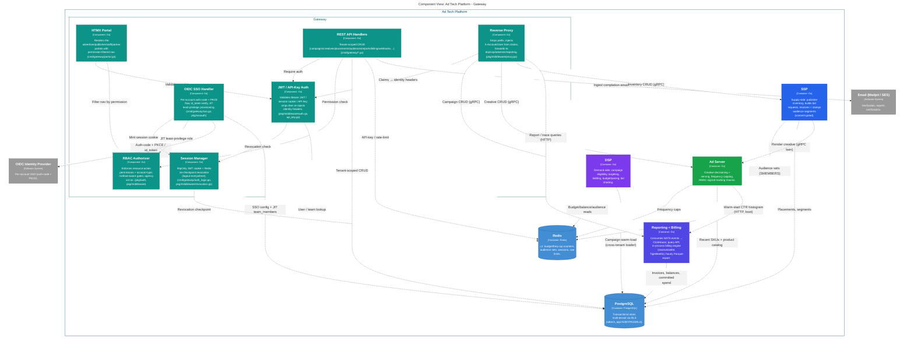

```mermaid
graph LR
  linkStyle default fill:#ffffff

  subgraph diagram ["Component View: Ad Tech Platform - Gateway"]
    style diagram fill:#ffffff,stroke:#ffffff

    7["<div style='font-weight: bold'>OIDC Identity Provider</div><div style='font-size: 70%; margin-top: 0px'>[Software System]</div><div style='font-size: 80%; margin-top:10px'>Per-account SSO (auth-code +<br />PKCE).</div>"]
    style 7 fill:#999999,stroke:#6b6b6b,color:#ffffff
    8["<div style='font-weight: bold'>Email (Mailpit / SES)</div><div style='font-size: 70%; margin-top: 0px'>[Software System]</div><div style='font-size: 80%; margin-top:10px'>Verification, reports,<br />notifications.</div>"]
    style 8 fill:#999999,stroke:#6b6b6b,color:#ffffff

    subgraph 9 ["Ad Tech Platform"]
      style 9 fill:#ffffff,stroke:#0b4884,color:#0b4884

      subgraph 10 ["Gateway"]
        style 10 fill:#ffffff,stroke:#0b7268,color:#0b7268

        11["<div style='font-weight: bold'>JWT / API-Key Auth</div><div style='font-size: 70%; margin-top: 0px'>[Component: Go]</div><div style='font-size: 80%; margin-top:10px'>Validates Bearer JWT /<br />session cookie / API key;<br />strips then re-injects<br />identity headers.<br />(pkg/middleware/auth.go,<br />api_key.go)</div>"]
        style 11 fill:#0d9488,stroke:#0b7268,color:#ffffff
        12["<div style='font-weight: bold'>OIDC SSO Handler</div><div style='font-size: 70%; margin-top: 0px'>[Component: Go]</div><div style='font-size: 80%; margin-top:10px'>Per-account auth-code + PKCE<br />flow, id_token verify, JIT<br />least-privilege provisioning.<br />(cmd/gateway/sso.go,<br />pkg/ssoauth)</div>"]
        style 12 fill:#0d9488,stroke:#0b7268,color:#ffffff
        13["<div style='font-weight: bold'>RBAC Authorizer</div><div style='font-size: 70%; margin-top: 0px'>[Component: Go]</div><div style='font-size: 80%; margin-top:10px'>Enforces resource:action<br />permissions + account-type;<br />method-aware gates; agency<br />act-as. (pkg/auth,<br />pkg/middleware)</div>"]
        style 13 fill:#0d9488,stroke:#0b7268,color:#ffffff
        14["<div style='font-weight: bold'>Session Manager</div><div style='font-size: 70%; margin-top: 0px'>[Component: Go]</div><div style='font-size: 80%; margin-top:10px'>httpOnly JWT cookie + Redis<br />iat-checkpoint revocation<br />(logout-everywhere).<br />(cmd/gateway/auth_login.go,<br />pkg/middleware/revocation.go)</div>"]
        style 14 fill:#0d9488,stroke:#0b7268,color:#ffffff
        15["<div style='font-weight: bold'>HTMX Portal</div><div style='font-size: 70%; margin-top: 0px'>[Component: Go]</div><div style='font-size: 80%; margin-top:10px'>Renders the<br />advertiser/publisher/staff/partner<br />portals with<br />permission-filtered nav.<br />(cmd/gateway/portal.go)</div>"]
        style 15 fill:#0d9488,stroke:#0b7268,color:#ffffff
        16["<div style='font-weight: bold'>REST API Handlers</div><div style='font-size: 70%; margin-top: 0px'>[Component: Go]</div><div style='font-size: 80%; margin-top:10px'>Tenant-scoped CRUD<br />(campaigns/creatives/placements/audiences/reports/billing/webhooks…).<br />(cmd/gateway/*.go)</div>"]
        style 16 fill:#0d9488,stroke:#0b7268,color:#ffffff
        17["<div style='font-weight: bold'>Reverse Proxy</div><div style='font-size: 70%; margin-top: 0px'>[Component: Go]</div><div style='font-size: 80%; margin-top:10px'>Strips prefix, injects<br />X-Account/User from claims,<br />forwards to<br />dsp/ssp/adserver/reporting.<br />(pkg/middleware/proxy.go)</div>"]
        style 17 fill:#0d9488,stroke:#0b7268,color:#ffffff
      end

      145[("<div style='font-weight: bold'>PostgreSQL</div><div style='font-size: 70%; margin-top: 0px'>[Container: PostgreSQL]</div><div style='font-size: 80%; margin-top:10px'>Transactional store,<br />multi-tenant via RLS<br />(adtech_app NOBYPASSRLS).</div>")]
      style 145 fill:#438dd5,stroke:#2e6295,color:#ffffff
      146[("<div style='font-weight: bold'>Redis</div><div style='font-size: 70%; margin-top: 0px'>[Container: Redis]</div><div style='font-size: 80%; margin-top:10px'>L2: budget/freq-cap counters,<br />audience sets, sessions, rate<br />limits.</div>")]
      style 146 fill:#438dd5,stroke:#2e6295,color:#ffffff
      18["<div style='font-weight: bold'>SSP</div><div style='font-size: 70%; margin-top: 0px'>[Container: Go]</div><div style='font-size: 80%; margin-top:10px'>Supply-side: publisher<br />inventory, builds bid<br />requests, resolves + stamps<br />audience segments<br />(consent-gated).</div>"]
      style 18 fill:#2563eb,stroke:#1e4fc2,color:#ffffff
      36["<div style='font-weight: bold'>DSP</div><div style='font-size: 70%; margin-top: 0px'>[Container: Go]</div><div style='font-size: 80%; margin-top:10px'>Demand-side: campaign<br />eligibility, targeting,<br />bidding, budget/pacing, bid<br />shading.</div>"]
      style 36 fill:#7c3aed,stroke:#6530c4,color:#ffffff
      44["<div style='font-weight: bold'>Ad Server</div><div style='font-size: 70%; margin-top: 0px'>[Container: Go]</div><div style='font-size: 80%; margin-top:10px'>Creative decisioning +<br />serving, frequency capping,<br />HMAC-signed tracking macros.</div>"]
      style 44 fill:#16a34a,stroke:#12863d,color:#ffffff
      85["<div style='font-weight: bold'>Reporting + Billing</div><div style='font-size: 70%; margin-top: 0px'>[Container: Go]</div><div style='font-size: 80%; margin-top:10px'>Consumes NATS events →<br />ClickHouse; query API;<br />in-process billing engine<br />(reserve/settle,<br />TigerBeetle); hourly Parquet<br />export.</div>"]
      style 85 fill:#4f46e5,stroke:#413abd,color:#ffffff
    end

    85-. "<div>Invoices, balances, committed<br />spend</div><div style='font-size: 70%'></div>" .->145
    36-. "<div>Budget/balance/audience reads</div><div style='font-size: 70%'></div>" .->146
    36-. "<div>Campaign warm-load<br />(cross-tenant loader)</div><div style='font-size: 70%'></div>" .->145
    18-. "<div>Audience sets (SMEMBERS)</div><div style='font-size: 70%'></div>" .->146
    18-. "<div>Placements, segments</div><div style='font-size: 70%'></div>" .->145
    44-. "<div>Frequency caps</div><div style='font-size: 70%'></div>" .->146
    18-. "<div>Render creative (gRPC twin)</div><div style='font-size: 70%'></div>" .->44
    44-. "<div>Recent SKUs + product catalog</div><div style='font-size: 70%'></div>" .->145
    44-. "<div>Warm-start CTR histogram<br />(HTTP, boot)</div><div style='font-size: 70%'></div>" .->85
    16-. "<div>Require auth</div><div style='font-size: 70%'></div>" .->11
    16-. "<div>Permission check</div><div style='font-size: 70%'></div>" .->13
    15-. "<div>Validate session</div><div style='font-size: 70%'></div>" .->11
    15-. "<div>Filter nav by permission</div><div style='font-size: 70%'></div>" .->13
    12-. "<div>Mint session cookie</div><div style='font-size: 70%'></div>" .->14
    12-. "<div>JIT least-privilege role</div><div style='font-size: 70%'></div>" .->13
    12-. "<div>Auth-code + PKCE / id_token<br />verify</div><div style='font-size: 70%'></div>" .->7
    11-. "<div>Revocation check</div><div style='font-size: 70%'></div>" .->14
    17-. "<div>Claims → identity headers</div><div style='font-size: 70%'></div>" .->11
    11-. "<div>User / team lookup</div><div style='font-size: 70%'></div>" .->145
    12-. "<div>SSO config + JIT team_members</div><div style='font-size: 70%'></div>" .->145
    14-. "<div>Revocation checkpoint</div><div style='font-size: 70%'></div>" .->146
    16-. "<div>Tenant-scoped CRUD</div><div style='font-size: 70%'></div>" .->145
    16-. "<div>API-key / rate-limit</div><div style='font-size: 70%'></div>" .->146
    16-. "<div>Ingest completion email</div><div style='font-size: 70%'></div>" .->8
    17-. "<div>Campaign CRUD (gRPC)</div><div style='font-size: 70%'></div>" .->36
    17-. "<div>Creative CRUD (gRPC)</div><div style='font-size: 70%'></div>" .->44
    17-. "<div>Inventory CRUD (gRPC)</div><div style='font-size: 70%'></div>" .->18
    17-. "<div>Report / trace queries (HTTP)</div><div style='font-size: 70%'></div>" .->85

  end
```
