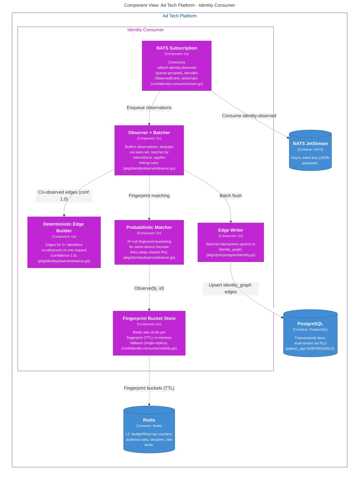

```mermaid
graph LR
  linkStyle default fill:#ffffff

  subgraph diagram ["Component View: Ad Tech Platform - Identity Consumer"]
    style diagram fill:#ffffff,stroke:#ffffff

    subgraph 9 ["Ad Tech Platform"]
      style 9 fill:#ffffff,stroke:#0b4884,color:#0b4884

      subgraph 100 ["Identity Consumer"]
        style 100 fill:#ffffff,stroke:#9e20ae,color:#9e20ae

        101["<div style='font-weight: bold'>NATS Subscription</div><div style='font-size: 70%; margin-top: 0px'>[Component: Go]</div><div style='font-size: 80%; margin-top:10px'>Consumes<br />adtech.identity.observed<br />(queue-grouped), decodes<br />ObservedEvent, acks/naks.<br />(cmd/identity-consumer/main.go)</div>"]
        style 101 fill:#c026d3,stroke:#9e20ae,color:#ffffff
        102["<div style='font-weight: bold'>Observer + Batcher</div><div style='font-size: 70%; margin-top: 0px'>[Component: Go]</div><div style='font-size: 80%; margin-top:10px'>Buffers observations, dedupes<br />via seen-set, batches by<br />interval/size, applies<br />linking rules.<br />(pkg/identityobserve/observe.go)</div>"]
        style 102 fill:#c026d3,stroke:#9e20ae,color:#ffffff
        103["<div style='font-weight: bold'>Deterministic Edge Builder</div><div style='font-size: 70%; margin-top: 0px'>[Component: Go]</div><div style='font-size: 80%; margin-top:10px'>Edges for 2+ identifiers<br />co-observed on one request<br />(confidence 1.0).<br />(pkg/identityobserve/observe.go)</div>"]
        style 103 fill:#c026d3,stroke:#9e20ae,color:#ffffff
        104["<div style='font-weight: bold'>Probabilistic Matcher</div><div style='font-size: 70%; margin-top: 0px'>[Component: Go]</div><div style='font-size: 80%; margin-top:10px'>IP+UA fingerprint bucketing<br />for same-device heuristic<br />links (skips shared IPs).<br />(pkg/identityobserve/observe.go)</div>"]
        style 104 fill:#c026d3,stroke:#9e20ae,color:#ffffff
        105["<div style='font-weight: bold'>Fingerprint Bucket Store</div><div style='font-size: 70%; margin-top: 0px'>[Component: Go]</div><div style='font-size: 80%; margin-top:10px'>Redis sets of ids per<br />fingerprint (TTL); in-memory<br />fallback (single-replica).<br />(cmd/identity-consumer/redisfp.go)</div>"]
        style 105 fill:#c026d3,stroke:#9e20ae,color:#ffffff
        106["<div style='font-weight: bold'>Edge Writer</div><div style='font-size: 70%; margin-top: 0px'>[Component: Go]</div><div style='font-size: 80%; margin-top:10px'>Batched idempotent upserts to<br />identity_graph.<br />(pkg/store/postgres/identity.go)</div>"]
        style 106 fill:#c026d3,stroke:#9e20ae,color:#ffffff
      end

      145[("<div style='font-weight: bold'>PostgreSQL</div><div style='font-size: 70%; margin-top: 0px'>[Container: PostgreSQL]</div><div style='font-size: 80%; margin-top:10px'>Transactional store,<br />multi-tenant via RLS<br />(adtech_app NOBYPASSRLS).</div>")]
      style 145 fill:#438dd5,stroke:#2e6295,color:#ffffff
      146[("<div style='font-weight: bold'>Redis</div><div style='font-size: 70%; margin-top: 0px'>[Container: Redis]</div><div style='font-size: 80%; margin-top:10px'>L2: budget/freq-cap counters,<br />audience sets, sessions, rate<br />limits.</div>")]
      style 146 fill:#438dd5,stroke:#2e6295,color:#ffffff
      148[("<div style='font-weight: bold'>NATS JetStream</div><div style='font-size: 70%; margin-top: 0px'>[Container: NATS]</div><div style='font-size: 80%; margin-top:10px'>Async event bus (JSON<br />payloads).</div>")]
      style 148 fill:#438dd5,stroke:#2e6295,color:#ffffff
    end

    101-. "<div>Consume identity.observed</div><div style='font-size: 70%'></div>" .->148
    101-. "<div>Enqueue observations</div><div style='font-size: 70%'></div>" .->102
    102-. "<div>Co-observed edges (conf 1.0)</div><div style='font-size: 70%'></div>" .->103
    102-. "<div>Fingerprint matching</div><div style='font-size: 70%'></div>" .->104
    102-. "<div>Batch flush</div><div style='font-size: 70%'></div>" .->106
    104-. "<div>Observe(fp, id)</div><div style='font-size: 70%'></div>" .->105
    105-. "<div>Fingerprint buckets (TTL)</div><div style='font-size: 70%'></div>" .->146
    106-. "<div>Upsert identity_graph edges</div><div style='font-size: 70%'></div>" .->145

  end
```
