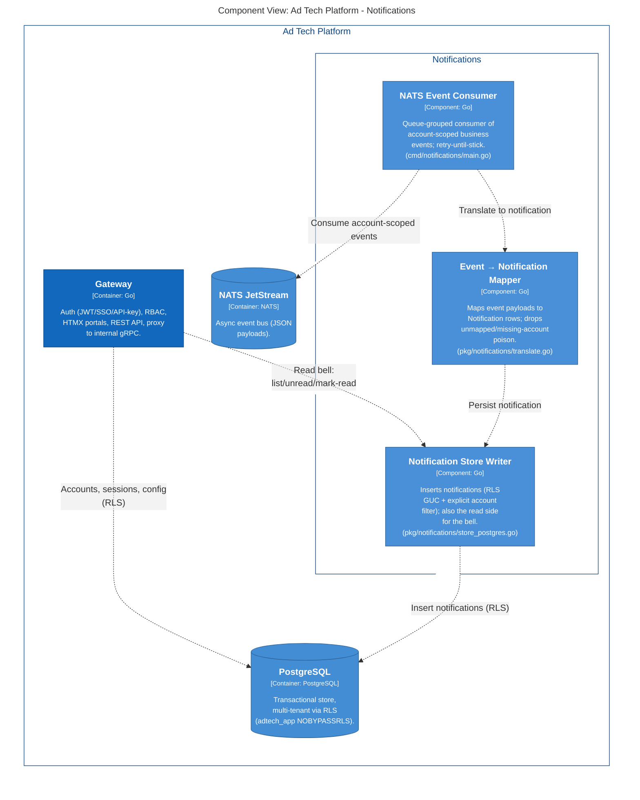

```mermaid
graph LR
  linkStyle default fill:#ffffff

  subgraph diagram ["Component View: Ad Tech Platform - Notifications"]
    style diagram fill:#ffffff,stroke:#ffffff

    subgraph 9 ["Ad Tech Platform"]
      style 9 fill:#ffffff,stroke:#0b4884,color:#0b4884

      subgraph 133 ["Notifications"]
        style 133 fill:#ffffff,stroke:#0b4884,color:#0b4884

        134["<div style='font-weight: bold'>NATS Event Consumer</div><div style='font-size: 70%; margin-top: 0px'>[Component: Go]</div><div style='font-size: 80%; margin-top:10px'>Queue-grouped consumer of<br />account-scoped business<br />events; retry-until-stick.<br />(cmd/notifications/main.go)</div>"]
        style 134 fill:#4a90d9,stroke:#336497,color:#ffffff
        135["<div style='font-weight: bold'>Event → Notification Mapper</div><div style='font-size: 70%; margin-top: 0px'>[Component: Go]</div><div style='font-size: 80%; margin-top:10px'>Maps event payloads to<br />Notification rows; drops<br />unmapped/missing-account<br />poison.<br />(pkg/notifications/translate.go)</div>"]
        style 135 fill:#4a90d9,stroke:#336497,color:#ffffff
        136["<div style='font-weight: bold'>Notification Store Writer</div><div style='font-size: 70%; margin-top: 0px'>[Component: Go]</div><div style='font-size: 80%; margin-top:10px'>Inserts notifications (RLS<br />GUC + explicit account<br />filter); also the read side<br />for the bell.<br />(pkg/notifications/store_postgres.go)</div>"]
        style 136 fill:#4a90d9,stroke:#336497,color:#ffffff
      end

      10["<div style='font-weight: bold'>Gateway</div><div style='font-size: 70%; margin-top: 0px'>[Container: Go]</div><div style='font-size: 80%; margin-top:10px'>Auth (JWT/SSO/API-key), RBAC,<br />HTMX portals, REST API, proxy<br />to internal gRPC.</div>"]
      style 10 fill:#1168bd,stroke:#0b4884,color:#ffffff
      145[("<div style='font-weight: bold'>PostgreSQL</div><div style='font-size: 70%; margin-top: 0px'>[Container: PostgreSQL]</div><div style='font-size: 80%; margin-top:10px'>Transactional store,<br />multi-tenant via RLS<br />(adtech_app NOBYPASSRLS).</div>")]
      style 145 fill:#438dd5,stroke:#2e6295,color:#ffffff
      148[("<div style='font-weight: bold'>NATS JetStream</div><div style='font-size: 70%; margin-top: 0px'>[Container: NATS]</div><div style='font-size: 80%; margin-top:10px'>Async event bus (JSON<br />payloads).</div>")]
      style 148 fill:#438dd5,stroke:#2e6295,color:#ffffff
    end

    10-. "<div>Accounts, sessions, config<br />(RLS)</div><div style='font-size: 70%'></div>" .->145
    134-. "<div>Consume account-scoped events</div><div style='font-size: 70%'></div>" .->148
    134-. "<div>Translate to notification</div><div style='font-size: 70%'></div>" .->135
    135-. "<div>Persist notification</div><div style='font-size: 70%'></div>" .->136
    136-. "<div>Insert notifications (RLS)</div><div style='font-size: 70%'></div>" .->145
    10-. "<div>Read bell:<br />list/unread/mark-read</div><div style='font-size: 70%'></div>" .->136

  end
```
