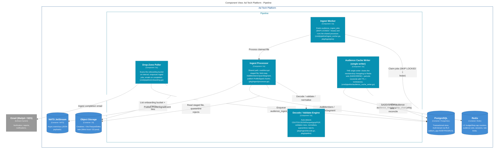

```mermaid
graph LR
  linkStyle default fill:#ffffff

  subgraph diagram ["Component View: Ad Tech Platform - Pipeline"]
    style diagram fill:#ffffff,stroke:#ffffff

    8["<div style='font-weight: bold'>Email (Mailpit / SES)</div><div style='font-size: 70%; margin-top: 0px'>[Software System]</div><div style='font-size: 80%; margin-top:10px'>Verification, reports,<br />notifications.</div>"]
    style 8 fill:#999999,stroke:#6b6b6b,color:#ffffff

    subgraph 9 ["Ad Tech Platform"]
      style 9 fill:#ffffff,stroke:#0b4884,color:#0b4884

      subgraph 94 ["Pipeline"]
        style 94 fill:#ffffff,stroke:#067793,color:#067793

        95["<div style='font-weight: bold'>Drop-Zone Poller</div><div style='font-size: 70%; margin-top: 0px'>[Component: Go]</div><div style='font-size: 80%; margin-top:10px'>Scans the onboarding bucket<br />on interval, enqueues ingest<br />jobs, emails on completion.<br />(cmd/pipeline/onboarding.go)</div>"]
        style 95 fill:#0891b2,stroke:#067793,color:#ffffff
        96["<div style='font-weight: bold'>Ingest Worker</div><div style='font-size: 70%; margin-top: 0px'>[Component: Go]</div><div style='font-size: 80%; margin-top:10px'>Drains audience_ingest_jobs<br />(SKIP LOCKED + lease) and<br />runs the shared processor.<br />(cmd/pipeline/ingest_worker.go,<br />pkg/ingestjobs)</div>"]
        style 96 fill:#0891b2,stroke:#067793,color:#ffffff
        97["<div style='font-weight: bold'>Ingest Processor</div><div style='font-size: 70%; margin-top: 0px'>[Component: Go]</div><div style='font-size: 80%; margin-top:10px'>Shared path: read/decrypt<br />staged file, field-map,<br />AddMembers/UpsertSegment,<br />publish ProfileSignal chunks.<br />(pkg/ingest/processor.go)</div>"]
        style 97 fill:#0891b2,stroke:#067793,color:#ffffff
        98["<div style='font-weight: bold'>Decode / Validate Engine</div><div style='font-size: 70%; margin-top: 0px'>[Component: Go]</div><div style='font-size: 80%; margin-top:10px'>Auto-detects<br />CSV/TSV/JSON/Parquet/gzip/PGP,<br />validates rows, normalises,<br />quarantines rejects.<br />(pkg/ingest/decode.go,<br />pkg/pipeline)</div>"]
        style 98 fill:#0891b2,stroke:#067793,color:#ffffff
        99["<div style='font-weight: bold'>Audience Cache Writer (single writer)</div><div style='font-size: 70%; margin-top: 0px'>[Component: Go]</div><div style='font-size: 80%; margin-top:10px'>THE single writer: drains the<br />membership changelog to Redis<br />sets (SADD/SREM) + periodic<br />reconcile with TTL +<br />tombstones.<br />(cmd/pipeline/audience_cache_writer.go)</div>"]
        style 99 fill:#0891b2,stroke:#067793,color:#ffffff
      end

      145[("<div style='font-weight: bold'>PostgreSQL</div><div style='font-size: 70%; margin-top: 0px'>[Container: PostgreSQL]</div><div style='font-size: 80%; margin-top:10px'>Transactional store,<br />multi-tenant via RLS<br />(adtech_app NOBYPASSRLS).</div>")]
      style 145 fill:#438dd5,stroke:#2e6295,color:#ffffff
      146[("<div style='font-weight: bold'>Redis</div><div style='font-size: 70%; margin-top: 0px'>[Container: Redis]</div><div style='font-size: 80%; margin-top:10px'>L2: budget/freq-cap counters,<br />audience sets, sessions, rate<br />limits.</div>")]
      style 146 fill:#438dd5,stroke:#2e6295,color:#ffffff
      148[("<div style='font-weight: bold'>NATS JetStream</div><div style='font-size: 70%; margin-top: 0px'>[Container: NATS]</div><div style='font-size: 80%; margin-top:10px'>Async event bus (JSON<br />payloads).</div>")]
      style 148 fill:#438dd5,stroke:#2e6295,color:#ffffff
      149[("<div style='font-weight: bold'>Object Storage</div><div style='font-size: 70%; margin-top: 0px'>[Container: S3]</div><div style='font-size: 80%; margin-top:10px'>Creatives + the Parquet/Delta<br />lake (Minio local / S3 prod).</div>")]
      style 149 fill:#438dd5,stroke:#2e6295,color:#ffffff
    end

    95-. "<div>List onboarding bucket + move<br />files</div><div style='font-size: 70%'></div>" .->149
    95-. "<div>Enqueue audience_ingest_jobs</div><div style='font-size: 70%'></div>" .->145
    95-. "<div>Ingest completion email</div><div style='font-size: 70%'></div>" .->8
    96-. "<div>Claim jobs (SKIP LOCKED +<br />lease)</div><div style='font-size: 70%'></div>" .->145
    96-. "<div>Process claimed file</div><div style='font-size: 70%'></div>" .->97
    97-. "<div>Decode / validate / normalise</div><div style='font-size: 70%'></div>" .->98
    97-. "<div>Read staged file, quarantine<br />rejects</div><div style='font-size: 70%'></div>" .->149
    97-. "<div>AddMembers / UpsertSegment</div><div style='font-size: 70%'></div>" .->145
    97-. "<div>Publish ProfileSignalEvent</div><div style='font-size: 70%'></div>" .->148
    99-. "<div>Drain<br />audience_membership_changelog</div><div style='font-size: 70%'></div>" .->145
    99-. "<div>SADD/SREM audience sets +<br />reconcile</div><div style='font-size: 70%'></div>" .->146

  end
```
