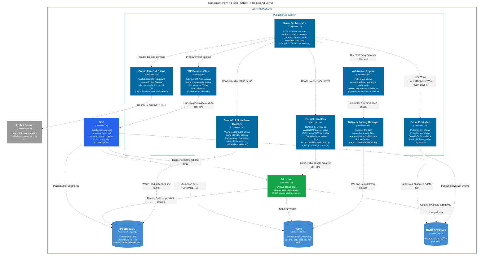

```mermaid
graph LR
  linkStyle default fill:#ffffff

  subgraph diagram ["Component View: Ad Tech Platform - Publisher Ad Server"]
    style diagram fill:#ffffff,stroke:#ffffff

    6["<div style='font-weight: bold'>Prebid Server</div><div style='font-size: 70%; margin-top: 0px'>[Software System]</div><div style='font-size: 80%; margin-top:10px'>Header-bidding demand the<br />publisher-adserver fans out<br />to.</div>"]
    style 6 fill:#999999,stroke:#6b6b6b,color:#ffffff

    subgraph 9 ["Ad Tech Platform"]
      style 9 fill:#ffffff,stroke:#0b4884,color:#0b4884

      subgraph 53 ["Publisher Ad Server"]
        style 53 fill:#ffffff,stroke:#025685,color:#025685

        54["<div style='font-weight: bold'>Serve Orchestrator</div><div style='font-size: 70%; margin-top: 0px'>[Component: Go]</div><div style='font-size: 80%; margin-top:10px'>HTTP serve handler: runs<br />arbitration → direct serve or<br />programmatic fan-out, renders<br />the winner per format.<br />(cmd/publisher-adserver/main.go)</div>"]
        style 54 fill:#0369a1,stroke:#025685,color:#ffffff
        55["<div style='font-weight: bold'>Arbitration Engine</div><div style='font-size: 70%; margin-top: 0px'>[Component: Go]</div><div style='font-size: 80%; margin-top:10px'>Picks direct-sold vs<br />programmatic per slot on the<br />priority ladder<br />sponsorship>guaranteed>house.<br />(pkg/publisheradserver/arbitration)</div>"]
        style 55 fill:#0369a1,stroke:#025685,color:#ffffff
        56["<div style='font-weight: bold'>Direct-Sold Line-Item Matcher</div><div style='font-size: 70%; margin-top: 0px'>[Component: Go]</div><div style='font-size: 80%; margin-top:10px'>Warm-cached publisher line<br />items filtered by status /<br />flight window / placement.<br />(pkg/publisheradserver,<br />cmd/publisher-adserver)</div>"]
        style 56 fill:#0369a1,stroke:#025685,color:#ffffff
        57["<div style='font-weight: bold'>Delivery Pacing Manager</div><div style='font-size: 70%; margin-top: 0px'>[Component: Go]</div><div style='font-size: 80%; margin-top:10px'>Redis per-line-item<br />impression actuals; flags<br />guaranteed items behind pace<br />(PacingDecider).<br />(pkg/publisheradserver/pacing)</div>"]
        style 57 fill:#0369a1,stroke:#025685,color:#ffffff
        58["<div style='font-weight: bold'>Prebid Fan-Out Client</div><div style='font-size: 70%; margin-top: 0px'>[Component: Go]</div><div style='font-size: 80%; margin-top:10px'>Parallel OpenRTB requests to<br />external Prebid Servers;<br />selects the highest non-nobid<br />bid.<br />(pkg/publisheradserver/prebidclient)</div>"]
        style 58 fill:#0369a1,stroke:#025685,color:#ffffff
        59["<div style='font-weight: bold'>SSP Demand Client</div><div style='font-size: 70%; margin-top: 0px'>[Component: Go]</div><div style='font-size: 80%; margin-top:10px'>Calls our SSP /v1/ssp/serve<br />for the programmatic auction<br />(exchange → DSPs),<br />channel-aware.<br />(cmd/publisher-adserver)</div>"]
        style 59 fill:#0369a1,stroke:#025685,color:#ffffff
        60["<div style='font-weight: bold'>Format Handlers</div><div style='font-size: 70%; margin-top: 0px'>[Component: Go]</div><div style='font-size: 80%; margin-top:10px'>Renders the winner as<br />VAST/VMAP (video), native<br />JSON, audio VAST, or display<br />HTML with signed tracker<br />URLs.<br />(cmd/publisher-adserver/vast.go,<br />vmap.go, native.go, audio.go)</div>"]
        style 60 fill:#0369a1,stroke:#025685,color:#ffffff
        61["<div style='font-weight: bold'>Event Publisher</div><div style='font-size: 70%; margin-top: 0px'>[Component: Go]</div><div style='font-size: 80%; margin-top:10px'>Publishes DirectWin /<br />PrebidOutboundWin /<br />ServeNoFill for analytics.<br />(cmd/publisher-adserver,<br />pkg/events)</div>"]
        style 61 fill:#0369a1,stroke:#025685,color:#ffffff
      end

      145[("<div style='font-weight: bold'>PostgreSQL</div><div style='font-size: 70%; margin-top: 0px'>[Container: PostgreSQL]</div><div style='font-size: 80%; margin-top:10px'>Transactional store,<br />multi-tenant via RLS<br />(adtech_app NOBYPASSRLS).</div>")]
      style 145 fill:#438dd5,stroke:#2e6295,color:#ffffff
      146[("<div style='font-weight: bold'>Redis</div><div style='font-size: 70%; margin-top: 0px'>[Container: Redis]</div><div style='font-size: 80%; margin-top:10px'>L2: budget/freq-cap counters,<br />audience sets, sessions, rate<br />limits.</div>")]
      style 146 fill:#438dd5,stroke:#2e6295,color:#ffffff
      148[("<div style='font-weight: bold'>NATS JetStream</div><div style='font-size: 70%; margin-top: 0px'>[Container: NATS]</div><div style='font-size: 80%; margin-top:10px'>Async event bus (JSON<br />payloads).</div>")]
      style 148 fill:#438dd5,stroke:#2e6295,color:#ffffff
      18["<div style='font-weight: bold'>SSP</div><div style='font-size: 70%; margin-top: 0px'>[Container: Go]</div><div style='font-size: 80%; margin-top:10px'>Supply-side: publisher<br />inventory, builds bid<br />requests, resolves + stamps<br />audience segments<br />(consent-gated).</div>"]
      style 18 fill:#2563eb,stroke:#1e4fc2,color:#ffffff
      44["<div style='font-weight: bold'>Ad Server</div><div style='font-size: 70%; margin-top: 0px'>[Container: Go]</div><div style='font-size: 80%; margin-top:10px'>Creative decisioning +<br />serving, frequency capping,<br />HMAC-signed tracking macros.</div>"]
      style 44 fill:#16a34a,stroke:#12863d,color:#ffffff
    end

    18-. "<div>Behaviour observed / data-fee</div><div style='font-size: 70%'></div>" .->148
    18-. "<div>Audience sets (SMEMBERS)</div><div style='font-size: 70%'></div>" .->146
    18-. "<div>Placements, segments</div><div style='font-size: 70%'></div>" .->145
    44-. "<div>Frequency caps</div><div style='font-size: 70%'></div>" .->146
    18-. "<div>Render creative (gRPC twin)</div><div style='font-size: 70%'></div>" .->44
    44-. "<div>Recent SKUs + product catalog</div><div style='font-size: 70%'></div>" .->145
    44-. "<div>Cache-invalidate (creatives /<br />campaigns)</div><div style='font-size: 70%'></div>" .->148
    54-. "<div>Direct vs programmatic<br />decision</div><div style='font-size: 70%'></div>" .->55
    54-. "<div>Candidate direct line items</div><div style='font-size: 70%'></div>" .->56
    54-. "<div>Programmatic auction</div><div style='font-size: 70%'></div>" .->59
    54-. "<div>Header-bidding demand</div><div style='font-size: 70%'></div>" .->58
    54-. "<div>Render winner per format</div><div style='font-size: 70%'></div>" .->60
    54-. "<div>DirectWin / PrebidOutboundWin<br />/ ServeNoFill</div><div style='font-size: 70%'></div>" .->61
    55-. "<div>Guaranteed behind-pace check</div><div style='font-size: 70%'></div>" .->57
    56-. "<div>Warm-load publisher line<br />items</div><div style='font-size: 70%'></div>" .->145
    57-. "<div>Per-line-item delivery<br />actuals</div><div style='font-size: 70%'></div>" .->146
    59-. "<div>Run programmatic auction<br />(HTTP)</div><div style='font-size: 70%'></div>" .->18
    58-. "<div>OpenRTB fan-out (HTTP)</div><div style='font-size: 70%'></div>" .->6
    60-. "<div>Render direct-sold creative<br />(HTTP)</div><div style='font-size: 70%'></div>" .->44
    61-. "<div>Publish serve/win events</div><div style='font-size: 70%'></div>" .->148

  end
```
