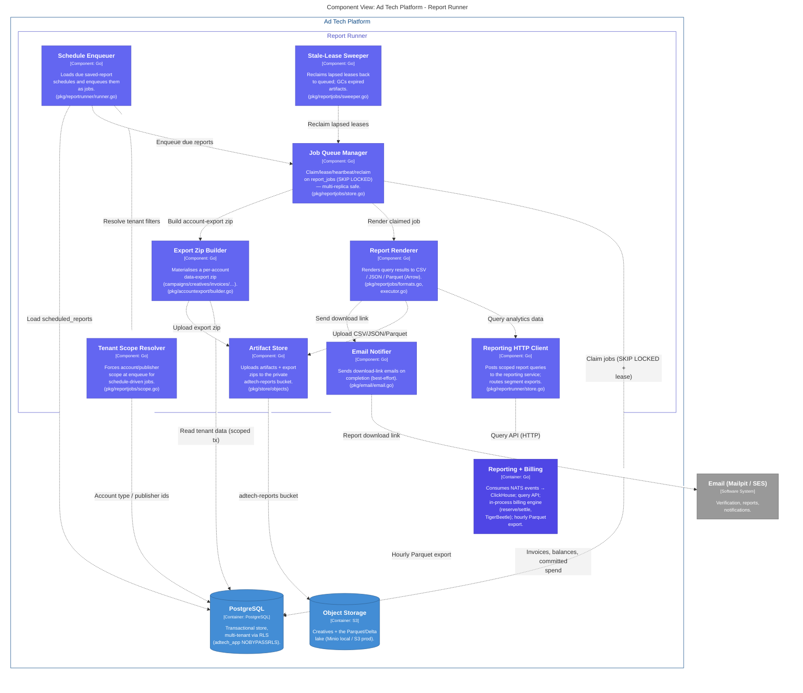

```mermaid
graph LR
  linkStyle default fill:#ffffff

  subgraph diagram ["Component View: Ad Tech Platform - Report Runner"]
    style diagram fill:#ffffff,stroke:#ffffff

    8["<div style='font-weight: bold'>Email (Mailpit / SES)</div><div style='font-size: 70%; margin-top: 0px'>[Software System]</div><div style='font-size: 80%; margin-top:10px'>Verification, reports,<br />notifications.</div>"]
    style 8 fill:#999999,stroke:#6b6b6b,color:#ffffff

    subgraph 9 ["Ad Tech Platform"]
      style 9 fill:#ffffff,stroke:#0b4884,color:#0b4884

      subgraph 115 ["Report Runner"]
        style 115 fill:#ffffff,stroke:#5255c7,color:#5255c7

        116["<div style='font-weight: bold'>Schedule Enqueuer</div><div style='font-size: 70%; margin-top: 0px'>[Component: Go]</div><div style='font-size: 80%; margin-top:10px'>Loads due saved-report<br />schedules and enqueues them<br />as jobs.<br />(pkg/reportrunner/runner.go)</div>"]
        style 116 fill:#6366f1,stroke:#5255c7,color:#ffffff
        117["<div style='font-weight: bold'>Job Queue Manager</div><div style='font-size: 70%; margin-top: 0px'>[Component: Go]</div><div style='font-size: 80%; margin-top:10px'>Claim/lease/heartbeat/reclaim<br />on report_jobs (SKIP LOCKED)<br />— multi-replica safe.<br />(pkg/reportjobs/store.go)</div>"]
        style 117 fill:#6366f1,stroke:#5255c7,color:#ffffff
        118["<div style='font-weight: bold'>Report Renderer</div><div style='font-size: 70%; margin-top: 0px'>[Component: Go]</div><div style='font-size: 80%; margin-top:10px'>Renders query results to CSV<br />/ JSON / Parquet (Arrow).<br />(pkg/reportjobs/formats.go,<br />executor.go)</div>"]
        style 118 fill:#6366f1,stroke:#5255c7,color:#ffffff
        119["<div style='font-weight: bold'>Reporting HTTP Client</div><div style='font-size: 70%; margin-top: 0px'>[Component: Go]</div><div style='font-size: 80%; margin-top:10px'>Posts scoped report queries<br />to the reporting service;<br />routes segment exports.<br />(pkg/reportrunner/store.go)</div>"]
        style 119 fill:#6366f1,stroke:#5255c7,color:#ffffff
        120["<div style='font-weight: bold'>Export Zip Builder</div><div style='font-size: 70%; margin-top: 0px'>[Component: Go]</div><div style='font-size: 80%; margin-top:10px'>Materialises a per-account<br />data-export zip<br />(campaigns/creatives/invoices/…).<br />(pkg/accountexport/builder.go)</div>"]
        style 120 fill:#6366f1,stroke:#5255c7,color:#ffffff
        121["<div style='font-weight: bold'>Email Notifier</div><div style='font-size: 70%; margin-top: 0px'>[Component: Go]</div><div style='font-size: 80%; margin-top:10px'>Sends download-link emails on<br />completion (best-effort).<br />(pkg/email/email.go)</div>"]
        style 121 fill:#6366f1,stroke:#5255c7,color:#ffffff
        122["<div style='font-weight: bold'>Artifact Store</div><div style='font-size: 70%; margin-top: 0px'>[Component: Go]</div><div style='font-size: 80%; margin-top:10px'>Uploads artifacts + export<br />zips to the private<br />adtech-reports bucket.<br />(pkg/store/objects)</div>"]
        style 122 fill:#6366f1,stroke:#5255c7,color:#ffffff
        123["<div style='font-weight: bold'>Stale-Lease Sweeper</div><div style='font-size: 70%; margin-top: 0px'>[Component: Go]</div><div style='font-size: 80%; margin-top:10px'>Reclaims lapsed leases back<br />to queued; GCs expired<br />artifacts.<br />(pkg/reportjobs/sweeper.go)</div>"]
        style 123 fill:#6366f1,stroke:#5255c7,color:#ffffff
        124["<div style='font-weight: bold'>Tenant Scope Resolver</div><div style='font-size: 70%; margin-top: 0px'>[Component: Go]</div><div style='font-size: 80%; margin-top:10px'>Forces account/publisher<br />scope at enqueue for<br />schedule-driven jobs.<br />(pkg/reportjobs/scope.go)</div>"]
        style 124 fill:#6366f1,stroke:#5255c7,color:#ffffff
      end

      145[("<div style='font-weight: bold'>PostgreSQL</div><div style='font-size: 70%; margin-top: 0px'>[Container: PostgreSQL]</div><div style='font-size: 80%; margin-top:10px'>Transactional store,<br />multi-tenant via RLS<br />(adtech_app NOBYPASSRLS).</div>")]
      style 145 fill:#438dd5,stroke:#2e6295,color:#ffffff
      149[("<div style='font-weight: bold'>Object Storage</div><div style='font-size: 70%; margin-top: 0px'>[Container: S3]</div><div style='font-size: 80%; margin-top:10px'>Creatives + the Parquet/Delta<br />lake (Minio local / S3 prod).</div>")]
      style 149 fill:#438dd5,stroke:#2e6295,color:#ffffff
      85["<div style='font-weight: bold'>Reporting + Billing</div><div style='font-size: 70%; margin-top: 0px'>[Container: Go]</div><div style='font-size: 80%; margin-top:10px'>Consumes NATS events →<br />ClickHouse; query API;<br />in-process billing engine<br />(reserve/settle,<br />TigerBeetle); hourly Parquet<br />export.</div>"]
      style 85 fill:#4f46e5,stroke:#413abd,color:#ffffff
    end

    85-. "<div>Invoices, balances, committed<br />spend</div><div style='font-size: 70%'></div>" .->145
    85-. "<div>Hourly Parquet export</div><div style='font-size: 70%'></div>" .->149
    116-. "<div>Resolve tenant filters</div><div style='font-size: 70%'></div>" .->124
    116-. "<div>Enqueue due reports</div><div style='font-size: 70%'></div>" .->117
    116-. "<div>Load scheduled_reports</div><div style='font-size: 70%'></div>" .->145
    117-. "<div>Claim jobs (SKIP LOCKED +<br />lease)</div><div style='font-size: 70%'></div>" .->145
    117-. "<div>Render claimed job</div><div style='font-size: 70%'></div>" .->118
    117-. "<div>Build account-export zip</div><div style='font-size: 70%'></div>" .->120
    123-. "<div>Reclaim lapsed leases</div><div style='font-size: 70%'></div>" .->117
    124-. "<div>Account type / publisher ids</div><div style='font-size: 70%'></div>" .->145
    118-. "<div>Query analytics data</div><div style='font-size: 70%'></div>" .->119
    118-. "<div>Upload CSV/JSON/Parquet</div><div style='font-size: 70%'></div>" .->122
    118-. "<div>Send download link</div><div style='font-size: 70%'></div>" .->121
    120-. "<div>Read tenant data (scoped tx)</div><div style='font-size: 70%'></div>" .->145
    120-. "<div>Upload export zip</div><div style='font-size: 70%'></div>" .->122
    119-. "<div>Query API (HTTP)</div><div style='font-size: 70%'></div>" .->85
    122-. "<div>adtech-reports bucket</div><div style='font-size: 70%'></div>" .->149
    121-. "<div>Report download link</div><div style='font-size: 70%'></div>" .->8

  end
```
