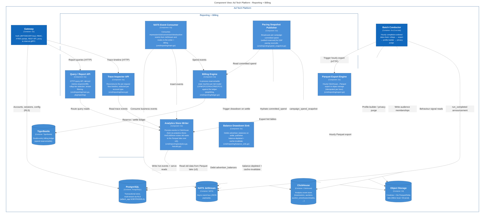

```mermaid
graph LR
  linkStyle default fill:#ffffff

  subgraph diagram ["Component View: Ad Tech Platform - Reporting + Billing"]
    style diagram fill:#ffffff,stroke:#ffffff

    subgraph 9 ["Ad Tech Platform"]
      style 9 fill:#ffffff,stroke:#0b4884,color:#0b4884

      subgraph 85 ["Reporting + Billing"]
        style 85 fill:#ffffff,stroke:#0b4884,color:#0b4884

        86["<div style='font-weight: bold'>NATS Event Consumer</div><div style='font-size: 70%; margin-top: 0px'>[Component: Go]</div><div style='font-size: 80%; margin-top:10px'>Consumes<br />impression/click/conversion/view/auction<br />events from JetStream and<br />routes to the writer +<br />billing.<br />(cmd/reporting/main.go)</div>"]
        style 86 fill:#4a90d9,stroke:#336497,color:#ffffff
        87["<div style='font-weight: bold'>Analytics Store Writer</div><div style='font-size: 70%; margin-top: 0px'>[Component: Go]</div><div style='font-size: 80%; margin-top:10px'>Persists events to ClickHouse<br />(hot) via analytics.Store;<br />HotColdStore routes old reads<br />to the Parquet lake over<br />s3().<br />(cmd/reporting/analytics.go,<br />hotcold.go)</div>"]
        style 87 fill:#4a90d9,stroke:#336497,color:#ffffff
        88["<div style='font-weight: bold'>Billing Engine</div><div style='font-size: 70%; margin-top: 0px'>[Component: Go]</div><div style='font-size: 80%; margin-top:10px'>In-process reserve/settle<br />state machine per bid model<br />(CPM/CPC/CPA/vCPM/CPCV)<br />against the ledger.<br />(pkg/billing,<br />cmd/reporting/ledger.go)</div>"]
        style 88 fill:#4a90d9,stroke:#336497,color:#ffffff
        89["<div style='font-weight: bold'>Balance Drawdown Sink</div><div style='font-size: 70%; margin-top: 0px'>[Component: Go]</div><div style='font-size: 80%; margin-top:10px'>Debits advertiser_balances on<br />settle; publishes<br />balance-depleted +<br />cache-invalidate.<br />(cmd/reporting/balance_sink.go)</div>"]
        style 89 fill:#4a90d9,stroke:#336497,color:#ffffff
        90["<div style='font-weight: bold'>Pacing Snapshot Publisher</div><div style='font-size: 70%; margin-top: 0px'>[Component: Go]</div><div style='font-size: 80%; margin-top:10px'>Broadcasts per-campaign<br />committed spend<br />(settled+reserved) for DSP<br />pacing reconcile.<br />(cmd/reporting/spend_snapshot.go)</div>"]
        style 90 fill:#4a90d9,stroke:#336497,color:#ffffff
        91["<div style='font-weight: bold'>Query / Report API</div><div style='font-size: 70%; margin-top: 0px'>[Component: Go]</div><div style='font-size: 80%; margin-top:10px'>HTTP query API: derived<br />metrics (ecpm/ctr/fill),<br />rollup-tier selection, tenant<br />filtering.<br />(cmd/reporting/main.go,<br />pkg/reporting)</div>"]
        style 91 fill:#4a90d9,stroke:#336497,color:#ffffff
        92["<div style='font-weight: bold'>Parquet Export Engine</div><div style='font-size: 70%; margin-top: 0px'>[Component: Go]</div><div style='font-size: 80%; margin-top:10px'>Hourly ClickHouse→Parquet<br />export to object storage<br />(idempotent per hour).<br />(cmd/reporting/export.go)</div>"]
        style 92 fill:#4a90d9,stroke:#336497,color:#ffffff
        93["<div style='font-weight: bold'>Trace Inspector API</div><div style='font-size: 70%; margin-top: 0px'>[Component: Go]</div><div style='font-size: 80%; margin-top:10px'>Reconstructs the per-request<br />flow timeline, redacted per<br />account type.<br />(cmd/reporting/trace.go)</div>"]
        style 93 fill:#4a90d9,stroke:#336497,color:#ffffff
      end

      10["<div style='font-weight: bold'>Gateway</div><div style='font-size: 70%; margin-top: 0px'>[Container: Go]</div><div style='font-size: 80%; margin-top:10px'>Auth (JWT/SSO/API-key), RBAC,<br />HTMX portals, REST API, proxy<br />to internal gRPC.</div>"]
      style 10 fill:#1168bd,stroke:#0b4884,color:#ffffff
      137["<div style='font-weight: bold'>Batch Conductor</div><div style='font-size: 70%; margin-top: 0px'>[Container: Go (CronJob)]</div><div style='font-size: 80%; margin-top:10px'>Hourly completion-ordered<br />data chain: rollups → export<br />→ profile-builder → privacy<br />purge.</div>"]
      style 137 fill:#1168bd,stroke:#0b4884,color:#ffffff
      145[("<div style='font-weight: bold'>PostgreSQL</div><div style='font-size: 70%; margin-top: 0px'>[Container: PostgreSQL]</div><div style='font-size: 80%; margin-top:10px'>Transactional store,<br />multi-tenant via RLS<br />(adtech_app NOBYPASSRLS).</div>")]
      style 145 fill:#438dd5,stroke:#2e6295,color:#ffffff
      147[("<div style='font-weight: bold'>ClickHouse</div><div style='font-size: 70%; margin-top: 0px'>[Container: ClickHouse]</div><div style='font-size: 80%; margin-top:10px'>Analytics event store<br />(impressions, auctions,<br />auction_wins/losses/shades,<br />…).</div>")]
      style 147 fill:#438dd5,stroke:#2e6295,color:#ffffff
      148[("<div style='font-weight: bold'>NATS JetStream</div><div style='font-size: 70%; margin-top: 0px'>[Container: NATS]</div><div style='font-size: 80%; margin-top:10px'>Async event bus (JSON<br />payloads).</div>")]
      style 148 fill:#438dd5,stroke:#2e6295,color:#ffffff
      149[("<div style='font-weight: bold'>Object Storage</div><div style='font-size: 70%; margin-top: 0px'>[Container: S3]</div><div style='font-size: 80%; margin-top:10px'>Creatives + the Parquet/Delta<br />lake (Minio local / S3 prod).</div>")]
      style 149 fill:#438dd5,stroke:#2e6295,color:#ffffff
      150[("<div style='font-weight: bold'>TigerBeetle</div><div style='font-size: 70%; margin-top: 0px'>[Container: TigerBeetle]</div><div style='font-size: 80%; margin-top:10px'>Double-entry billing ledger<br />(spend reserve/settle).</div>")]
      style 150 fill:#438dd5,stroke:#2e6295,color:#ffffff
    end

    10-. "<div>Accounts, sessions, config<br />(RLS)</div><div style='font-size: 70%'></div>" .->145
    137-. "<div>Profile-builder / privacy<br />purge</div><div style='font-size: 70%'></div>" .->149
    86-. "<div>Consume business events</div><div style='font-size: 70%'></div>" .->148
    86-. "<div>Insert events</div><div style='font-size: 70%'></div>" .->87
    86-. "<div>Spend events</div><div style='font-size: 70%'></div>" .->88
    87-. "<div>Write hot events + serve<br />reads</div><div style='font-size: 70%'></div>" .->147
    87-. "<div>Read old data from Parquet<br />lake (s3)</div><div style='font-size: 70%'></div>" .->149
    88-. "<div>Reserve / settle ledger</div><div style='font-size: 70%'></div>" .->150
    88-. "<div>Trigger drawdown on settle</div><div style='font-size: 70%'></div>" .->89
    89-. "<div>Debit advertiser_balances</div><div style='font-size: 70%'></div>" .->145
    89-. "<div>balance-depleted +<br />cache-invalidate</div><div style='font-size: 70%'></div>" .->148
    90-. "<div>Read committed spend</div><div style='font-size: 70%'></div>" .->88
    90-. "<div>Hydrate committed_spend</div><div style='font-size: 70%'></div>" .->145
    90-. "<div>campaign_spend_snapshot</div><div style='font-size: 70%'></div>" .->148
    91-. "<div>Route query reads</div><div style='font-size: 70%'></div>" .->87
    92-. "<div>Export hot tables</div><div style='font-size: 70%'></div>" .->87
    92-. "<div>Hourly Parquet export</div><div style='font-size: 70%'></div>" .->149
    93-. "<div>Read trace events</div><div style='font-size: 70%'></div>" .->87
    10-. "<div>Report queries (HTTP)</div><div style='font-size: 70%'></div>" .->91
    10-. "<div>Trace timeline (HTTP)</div><div style='font-size: 70%'></div>" .->93
    137-. "<div>Trigger hourly export (HTTP)</div><div style='font-size: 70%'></div>" .->92
    137-. "<div>Write audience memberships</div><div style='font-size: 70%'></div>" .->145
    137-. "<div>Behaviour signal reads</div><div style='font-size: 70%'></div>" .->147
    137-. "<div>run_completed announcement</div><div style='font-size: 70%'></div>" .->148

  end
```
