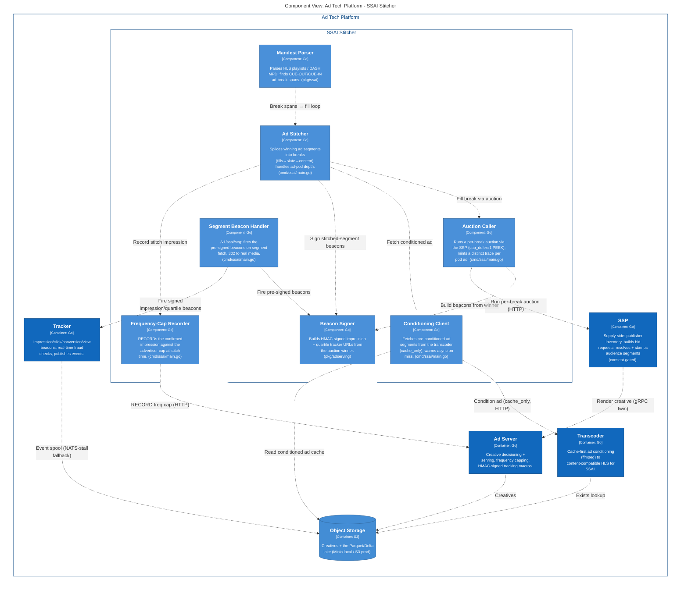

```mermaid
graph LR
  linkStyle default fill:#ffffff

  subgraph diagram ["Component View: Ad Tech Platform - SSAI Stitcher"]
    style diagram fill:#ffffff,stroke:#ffffff

    subgraph 9 ["Ad Tech Platform"]
      style 9 fill:#ffffff,stroke:#0b4884,color:#0b4884

      subgraph 71 ["SSAI Stitcher"]
        style 71 fill:#ffffff,stroke:#0b4884,color:#0b4884

        72["<div style='font-weight: bold'>Manifest Parser</div><div style='font-size: 70%; margin-top: 0px'>[Component: Go]</div><div style='font-size: 80%; margin-top:10px'>Parses HLS playlists / DASH<br />MPD, finds CUE-OUT/CUE-IN<br />ad-break spans. (pkg/ssai)</div>"]
        style 72 fill:#4a90d9,stroke:#336497,color:#ffffff
        73["<div style='font-weight: bold'>Auction Caller</div><div style='font-size: 70%; margin-top: 0px'>[Component: Go]</div><div style='font-size: 80%; margin-top:10px'>Runs a per-break auction via<br />the SSP (cap_defer=1 PEEK);<br />mints a distinct trace per<br />pod ad. (cmd/ssai/main.go)</div>"]
        style 73 fill:#4a90d9,stroke:#336497,color:#ffffff
        74["<div style='font-weight: bold'>Ad Stitcher</div><div style='font-size: 70%; margin-top: 0px'>[Component: Go]</div><div style='font-size: 80%; margin-top:10px'>Splices winning ad segments<br />into breaks<br />(fills→slate→content),<br />handles ad-pod depth.<br />(cmd/ssai/main.go)</div>"]
        style 74 fill:#4a90d9,stroke:#336497,color:#ffffff
        75["<div style='font-weight: bold'>Conditioning Client</div><div style='font-size: 70%; margin-top: 0px'>[Component: Go]</div><div style='font-size: 80%; margin-top:10px'>Fetches pre-conditioned ad<br />segments from the transcoder<br />(cache_only); warms async on<br />miss. (cmd/ssai/main.go)</div>"]
        style 75 fill:#4a90d9,stroke:#336497,color:#ffffff
        76["<div style='font-weight: bold'>Beacon Signer</div><div style='font-size: 70%; margin-top: 0px'>[Component: Go]</div><div style='font-size: 80%; margin-top:10px'>Builds HMAC-signed impression<br />+ quartile tracker URLs from<br />the auction winner.<br />(pkg/adserving)</div>"]
        style 76 fill:#4a90d9,stroke:#336497,color:#ffffff
        77["<div style='font-weight: bold'>Segment Beacon Handler</div><div style='font-size: 70%; margin-top: 0px'>[Component: Go]</div><div style='font-size: 80%; margin-top:10px'>/v1/ssai/seg: fires the<br />pre-signed beacons on segment<br />fetch, 302 to real media.<br />(cmd/ssai/main.go)</div>"]
        style 77 fill:#4a90d9,stroke:#336497,color:#ffffff
        78["<div style='font-weight: bold'>Frequency-Cap Recorder</div><div style='font-size: 70%; margin-top: 0px'>[Component: Go]</div><div style='font-size: 80%; margin-top:10px'>RECORDs the confirmed<br />impression against the<br />advertiser cap at stitch<br />time. (cmd/ssai/main.go)</div>"]
        style 78 fill:#4a90d9,stroke:#336497,color:#ffffff
      end

      149[("<div style='font-weight: bold'>Object Storage</div><div style='font-size: 70%; margin-top: 0px'>[Container: S3]</div><div style='font-size: 80%; margin-top:10px'>Creatives + the Parquet/Delta<br />lake (Minio local / S3 prod).</div>")]
      style 149 fill:#438dd5,stroke:#2e6295,color:#ffffff
      18["<div style='font-weight: bold'>SSP</div><div style='font-size: 70%; margin-top: 0px'>[Container: Go]</div><div style='font-size: 80%; margin-top:10px'>Supply-side: publisher<br />inventory, builds bid<br />requests, resolves + stamps<br />audience segments<br />(consent-gated).</div>"]
      style 18 fill:#1168bd,stroke:#0b4884,color:#ffffff
      44["<div style='font-weight: bold'>Ad Server</div><div style='font-size: 70%; margin-top: 0px'>[Container: Go]</div><div style='font-size: 80%; margin-top:10px'>Creative decisioning +<br />serving, frequency capping,<br />HMAC-signed tracking macros.</div>"]
      style 44 fill:#1168bd,stroke:#0b4884,color:#ffffff
      62["<div style='font-weight: bold'>Tracker</div><div style='font-size: 70%; margin-top: 0px'>[Container: Go]</div><div style='font-size: 80%; margin-top:10px'>Impression/click/conversion/view<br />beacons, real-time fraud<br />checks, publishes events.</div>"]
      style 62 fill:#1168bd,stroke:#0b4884,color:#ffffff
      79["<div style='font-weight: bold'>Transcoder</div><div style='font-size: 70%; margin-top: 0px'>[Container: Go]</div><div style='font-size: 80%; margin-top:10px'>Cache-first ad conditioning<br />(ffmpeg) to<br />content-compatible HLS for<br />SSAI.</div>"]
      style 79 fill:#1168bd,stroke:#0b4884,color:#ffffff
    end

    44-. "<div>Creatives</div><div style='font-size: 70%'></div>" .->149
    18-. "<div>Render creative (gRPC twin)</div><div style='font-size: 70%'></div>" .->44
    62-. "<div>Event spool (NATS-stall<br />fallback)</div><div style='font-size: 70%'></div>" .->149
    72-. "<div>Break spans → fill loop</div><div style='font-size: 70%'></div>" .->74
    74-. "<div>Fill break via auction</div><div style='font-size: 70%'></div>" .->73
    74-. "<div>Fetch conditioned ad</div><div style='font-size: 70%'></div>" .->75
    74-. "<div>Sign stitched-segment beacons</div><div style='font-size: 70%'></div>" .->76
    74-. "<div>Record stitch impression</div><div style='font-size: 70%'></div>" .->78
    73-. "<div>Build beacons from winner</div><div style='font-size: 70%'></div>" .->76
    77-. "<div>Fire pre-signed beacons</div><div style='font-size: 70%'></div>" .->76
    73-. "<div>Run per-break auction (HTTP)</div><div style='font-size: 70%'></div>" .->18
    75-. "<div>Condition ad (cache_only,<br />HTTP)</div><div style='font-size: 70%'></div>" .->79
    75-. "<div>Read conditioned ad cache</div><div style='font-size: 70%'></div>" .->149
    78-. "<div>RECORD freq cap (HTTP)</div><div style='font-size: 70%'></div>" .->44
    77-. "<div>Fire signed<br />impression/quartile beacons</div><div style='font-size: 70%'></div>" .->62
    79-. "<div>Exists lookup</div><div style='font-size: 70%'></div>" .->149

  end
```
