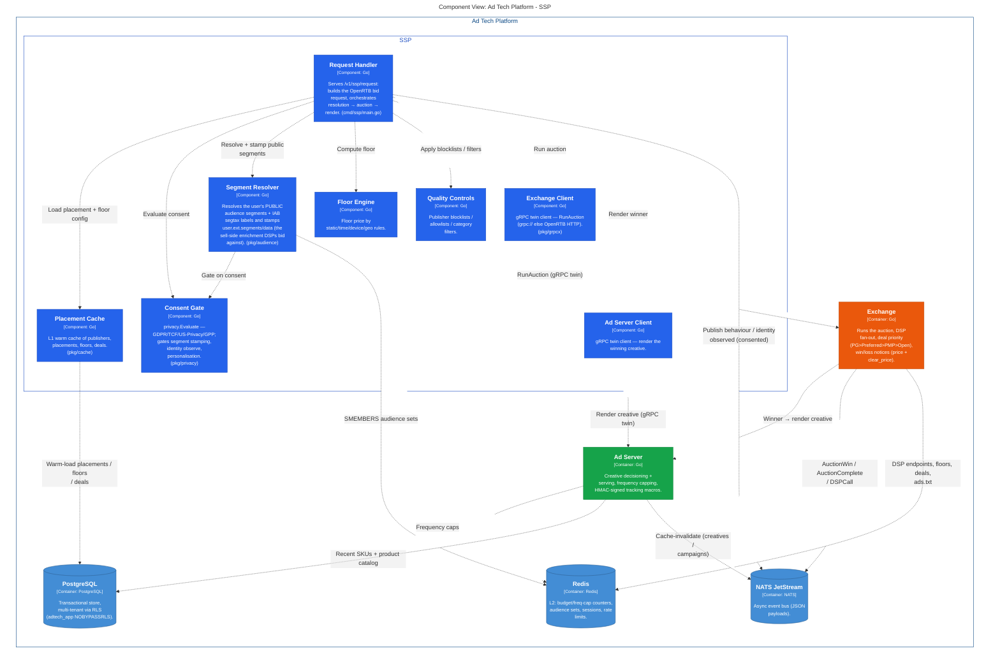

```mermaid
graph LR
  linkStyle default fill:#ffffff

  subgraph diagram ["Component View: Ad Tech Platform - SSP"]
    style diagram fill:#ffffff,stroke:#ffffff

    subgraph 9 ["Ad Tech Platform"]
      style 9 fill:#ffffff,stroke:#0b4884,color:#0b4884

      subgraph 18 ["SSP"]
        style 18 fill:#ffffff,stroke:#1e4fc2,color:#1e4fc2

        19["<div style='font-weight: bold'>Request Handler</div><div style='font-size: 70%; margin-top: 0px'>[Component: Go]</div><div style='font-size: 80%; margin-top:10px'>Serves /v1/ssp/request:<br />builds the OpenRTB bid<br />request, orchestrates<br />resolution → auction →<br />render. (cmd/ssp/main.go)</div>"]
        style 19 fill:#2563eb,stroke:#1e4fc2,color:#ffffff
        20["<div style='font-weight: bold'>Segment Resolver</div><div style='font-size: 70%; margin-top: 0px'>[Component: Go]</div><div style='font-size: 80%; margin-top:10px'>Resolves the user's PUBLIC<br />audience segments + IAB<br />segtax labels and stamps<br />user.ext.segments/data (the<br />sell-side enrichment DSPs bid<br />against). (pkg/audience)</div>"]
        style 20 fill:#2563eb,stroke:#1e4fc2,color:#ffffff
        21["<div style='font-weight: bold'>Consent Gate</div><div style='font-size: 70%; margin-top: 0px'>[Component: Go]</div><div style='font-size: 80%; margin-top:10px'>privacy.Evaluate —<br />GDPR/TCF/US-Privacy/GPP;<br />gates segment stamping,<br />identity observe,<br />personalisation.<br />(pkg/privacy)</div>"]
        style 21 fill:#2563eb,stroke:#1e4fc2,color:#ffffff
        22["<div style='font-weight: bold'>Floor Engine</div><div style='font-size: 70%; margin-top: 0px'>[Component: Go]</div><div style='font-size: 80%; margin-top:10px'>Floor price by<br />static/time/device/geo rules.</div>"]
        style 22 fill:#2563eb,stroke:#1e4fc2,color:#ffffff
        23["<div style='font-weight: bold'>Quality Controls</div><div style='font-size: 70%; margin-top: 0px'>[Component: Go]</div><div style='font-size: 80%; margin-top:10px'>Publisher blocklists /<br />allowlists / category<br />filters.</div>"]
        style 23 fill:#2563eb,stroke:#1e4fc2,color:#ffffff
        24["<div style='font-weight: bold'>Placement Cache</div><div style='font-size: 70%; margin-top: 0px'>[Component: Go]</div><div style='font-size: 80%; margin-top:10px'>L1 warm cache of publishers,<br />placements, floors, deals.<br />(pkg/cache)</div>"]
        style 24 fill:#2563eb,stroke:#1e4fc2,color:#ffffff
        25["<div style='font-weight: bold'>Exchange Client</div><div style='font-size: 70%; margin-top: 0px'>[Component: Go]</div><div style='font-size: 80%; margin-top:10px'>gRPC twin client — RunAuction<br />(grpc:// else OpenRTB HTTP).<br />(pkg/grpcx)</div>"]
        style 25 fill:#2563eb,stroke:#1e4fc2,color:#ffffff
        26["<div style='font-weight: bold'>Ad Server Client</div><div style='font-size: 70%; margin-top: 0px'>[Component: Go]</div><div style='font-size: 80%; margin-top:10px'>gRPC twin client — render the<br />winning creative.</div>"]
        style 26 fill:#2563eb,stroke:#1e4fc2,color:#ffffff
      end

      145[("<div style='font-weight: bold'>PostgreSQL</div><div style='font-size: 70%; margin-top: 0px'>[Container: PostgreSQL]</div><div style='font-size: 80%; margin-top:10px'>Transactional store,<br />multi-tenant via RLS<br />(adtech_app NOBYPASSRLS).</div>")]
      style 145 fill:#438dd5,stroke:#2e6295,color:#ffffff
      146[("<div style='font-weight: bold'>Redis</div><div style='font-size: 70%; margin-top: 0px'>[Container: Redis]</div><div style='font-size: 80%; margin-top:10px'>L2: budget/freq-cap counters,<br />audience sets, sessions, rate<br />limits.</div>")]
      style 146 fill:#438dd5,stroke:#2e6295,color:#ffffff
      148[("<div style='font-weight: bold'>NATS JetStream</div><div style='font-size: 70%; margin-top: 0px'>[Container: NATS]</div><div style='font-size: 80%; margin-top:10px'>Async event bus (JSON<br />payloads).</div>")]
      style 148 fill:#438dd5,stroke:#2e6295,color:#ffffff
      27["<div style='font-weight: bold'>Exchange</div><div style='font-size: 70%; margin-top: 0px'>[Container: Go]</div><div style='font-size: 80%; margin-top:10px'>Runs the auction, DSP<br />fan-out, deal priority<br />(PG>Preferred>PMP>Open),<br />win/loss notices (price +<br />clear_price).</div>"]
      style 27 fill:#ea580c,stroke:#c2490a,color:#ffffff
      44["<div style='font-weight: bold'>Ad Server</div><div style='font-size: 70%; margin-top: 0px'>[Container: Go]</div><div style='font-size: 80%; margin-top:10px'>Creative decisioning +<br />serving, frequency capping,<br />HMAC-signed tracking macros.</div>"]
      style 44 fill:#16a34a,stroke:#12863d,color:#ffffff
    end

    27-. "<div>Winner → render creative</div><div style='font-size: 70%'></div>" .->44
    27-. "<div>AuctionWin / AuctionComplete<br />/ DSPCall</div><div style='font-size: 70%'></div>" .->148
    44-. "<div>Frequency caps</div><div style='font-size: 70%'></div>" .->146
    19-. "<div>Load placement + floor config</div><div style='font-size: 70%'></div>" .->24
    19-. "<div>Evaluate consent</div><div style='font-size: 70%'></div>" .->21
    19-. "<div>Resolve + stamp public<br />segments</div><div style='font-size: 70%'></div>" .->20
    19-. "<div>Compute floor</div><div style='font-size: 70%'></div>" .->22
    19-. "<div>Apply blocklists / filters</div><div style='font-size: 70%'></div>" .->23
    19-. "<div>Run auction</div><div style='font-size: 70%'></div>" .->25
    19-. "<div>Render winner</div><div style='font-size: 70%'></div>" .->26
    20-. "<div>Gate on consent</div><div style='font-size: 70%'></div>" .->21
    20-. "<div>SMEMBERS audience sets</div><div style='font-size: 70%'></div>" .->146
    24-. "<div>Warm-load placements / floors<br />/ deals</div><div style='font-size: 70%'></div>" .->145
    25-. "<div>RunAuction (gRPC twin)</div><div style='font-size: 70%'></div>" .->27
    26-. "<div>Render creative (gRPC twin)</div><div style='font-size: 70%'></div>" .->44
    19-. "<div>Publish behaviour / identity<br />observed (consented)</div><div style='font-size: 70%'></div>" .->148
    27-. "<div>DSP endpoints, floors, deals,<br />ads.txt</div><div style='font-size: 70%'></div>" .->146
    44-. "<div>Recent SKUs + product catalog</div><div style='font-size: 70%'></div>" .->145
    44-. "<div>Cache-invalidate (creatives /<br />campaigns)</div><div style='font-size: 70%'></div>" .->148

  end
```
