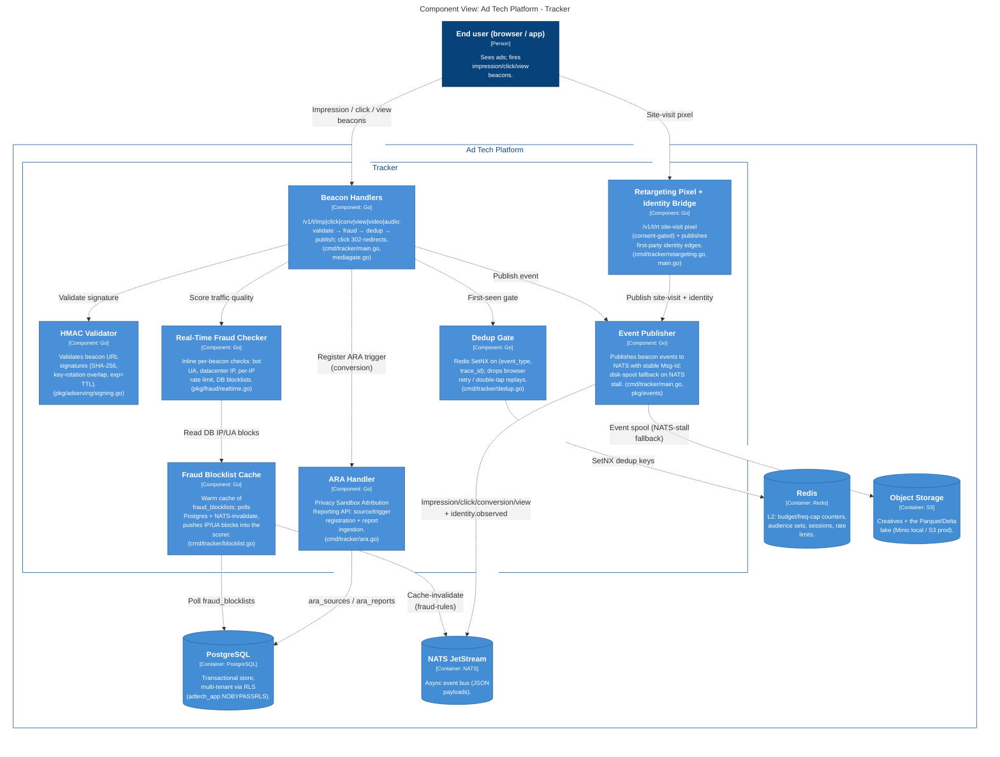

```mermaid
graph LR
  linkStyle default fill:#ffffff

  subgraph diagram ["Component View: Ad Tech Platform - Tracker"]
    style diagram fill:#ffffff,stroke:#ffffff

    4["<div style='font-weight: bold'>End user (browser / app)</div><div style='font-size: 70%; margin-top: 0px'>[Person]</div><div style='font-size: 80%; margin-top:10px'>Sees ads; fires<br />impression/click/view<br />beacons.</div>"]
    style 4 fill:#08427b,stroke:#052e56,color:#ffffff

    subgraph 9 ["Ad Tech Platform"]
      style 9 fill:#ffffff,stroke:#0b4884,color:#0b4884

      subgraph 62 ["Tracker"]
        style 62 fill:#ffffff,stroke:#0b4884,color:#0b4884

        63["<div style='font-weight: bold'>Beacon Handlers</div><div style='font-size: 70%; margin-top: 0px'>[Component: Go]</div><div style='font-size: 80%; margin-top:10px'>/v1/t/imp|click|conv|view|video|audio:<br />validate → fraud → dedup →<br />publish; click 302-redirects.<br />(cmd/tracker/main.go,<br />mediagate.go)</div>"]
        style 63 fill:#4a90d9,stroke:#336497,color:#ffffff
        64["<div style='font-weight: bold'>HMAC Validator</div><div style='font-size: 70%; margin-top: 0px'>[Component: Go]</div><div style='font-size: 80%; margin-top:10px'>Validates beacon URL<br />signatures (SHA-256,<br />key-rotation overlap, exp=<br />TTL).<br />(pkg/adserving/signing.go)</div>"]
        style 64 fill:#4a90d9,stroke:#336497,color:#ffffff
        65["<div style='font-weight: bold'>Real-Time Fraud Checker</div><div style='font-size: 70%; margin-top: 0px'>[Component: Go]</div><div style='font-size: 80%; margin-top:10px'>Inline per-beacon checks: bot<br />UA, datacenter IP, per-IP<br />rate limit, DB blocklists.<br />(pkg/fraud/realtime.go)</div>"]
        style 65 fill:#4a90d9,stroke:#336497,color:#ffffff
        66["<div style='font-weight: bold'>Fraud Blocklist Cache</div><div style='font-size: 70%; margin-top: 0px'>[Component: Go]</div><div style='font-size: 80%; margin-top:10px'>Warm cache of<br />fraud_blocklists; polls<br />Postgres + NATS-invalidate,<br />pushes IP/UA blocks into the<br />scorer.<br />(cmd/tracker/blocklist.go)</div>"]
        style 66 fill:#4a90d9,stroke:#336497,color:#ffffff
        67["<div style='font-weight: bold'>Dedup Gate</div><div style='font-size: 70%; margin-top: 0px'>[Component: Go]</div><div style='font-size: 80%; margin-top:10px'>Redis SetNX on (event_type,<br />trace_id); drops browser<br />retry / double-tap replays.<br />(cmd/tracker/dedup.go)</div>"]
        style 67 fill:#4a90d9,stroke:#336497,color:#ffffff
        68["<div style='font-weight: bold'>Event Publisher</div><div style='font-size: 70%; margin-top: 0px'>[Component: Go]</div><div style='font-size: 80%; margin-top:10px'>Publishes beacon events to<br />NATS with stable Msg-Id;<br />disk-spool fallback on NATS<br />stall. (cmd/tracker/main.go,<br />pkg/events)</div>"]
        style 68 fill:#4a90d9,stroke:#336497,color:#ffffff
        69["<div style='font-weight: bold'>Retargeting Pixel + Identity Bridge</div><div style='font-size: 70%; margin-top: 0px'>[Component: Go]</div><div style='font-size: 80%; margin-top:10px'>/v1/t/rt site-visit pixel<br />(consent-gated) + publishes<br />first-party identity edges.<br />(cmd/tracker/retargeting.go,<br />main.go)</div>"]
        style 69 fill:#4a90d9,stroke:#336497,color:#ffffff
        70["<div style='font-weight: bold'>ARA Handler</div><div style='font-size: 70%; margin-top: 0px'>[Component: Go]</div><div style='font-size: 80%; margin-top:10px'>Privacy Sandbox Attribution<br />Reporting API: source/trigger<br />registration + report<br />ingestion.<br />(cmd/tracker/ara.go)</div>"]
        style 70 fill:#4a90d9,stroke:#336497,color:#ffffff
      end

      145[("<div style='font-weight: bold'>PostgreSQL</div><div style='font-size: 70%; margin-top: 0px'>[Container: PostgreSQL]</div><div style='font-size: 80%; margin-top:10px'>Transactional store,<br />multi-tenant via RLS<br />(adtech_app NOBYPASSRLS).</div>")]
      style 145 fill:#438dd5,stroke:#2e6295,color:#ffffff
      146[("<div style='font-weight: bold'>Redis</div><div style='font-size: 70%; margin-top: 0px'>[Container: Redis]</div><div style='font-size: 80%; margin-top:10px'>L2: budget/freq-cap counters,<br />audience sets, sessions, rate<br />limits.</div>")]
      style 146 fill:#438dd5,stroke:#2e6295,color:#ffffff
      148[("<div style='font-weight: bold'>NATS JetStream</div><div style='font-size: 70%; margin-top: 0px'>[Container: NATS]</div><div style='font-size: 80%; margin-top:10px'>Async event bus (JSON<br />payloads).</div>")]
      style 148 fill:#438dd5,stroke:#2e6295,color:#ffffff
      149[("<div style='font-weight: bold'>Object Storage</div><div style='font-size: 70%; margin-top: 0px'>[Container: S3]</div><div style='font-size: 80%; margin-top:10px'>Creatives + the Parquet/Delta<br />lake (Minio local / S3 prod).</div>")]
      style 149 fill:#438dd5,stroke:#2e6295,color:#ffffff
    end

    4-. "<div>Impression / click / view<br />beacons</div><div style='font-size: 70%'></div>" .->63
    4-. "<div>Site-visit pixel</div><div style='font-size: 70%'></div>" .->69
    63-. "<div>Validate signature</div><div style='font-size: 70%'></div>" .->64
    63-. "<div>Score traffic quality</div><div style='font-size: 70%'></div>" .->65
    63-. "<div>First-seen gate</div><div style='font-size: 70%'></div>" .->67
    63-. "<div>Publish event</div><div style='font-size: 70%'></div>" .->68
    63-. "<div>Register ARA trigger<br />(conversion)</div><div style='font-size: 70%'></div>" .->70
    65-. "<div>Read DB IP/UA blocks</div><div style='font-size: 70%'></div>" .->66
    66-. "<div>Poll fraud_blocklists</div><div style='font-size: 70%'></div>" .->145
    66-. "<div>Cache-invalidate<br />(fraud-rules)</div><div style='font-size: 70%'></div>" .->148
    69-. "<div>Publish site-visit + identity</div><div style='font-size: 70%'></div>" .->68
    67-. "<div>SetNX dedup keys</div><div style='font-size: 70%'></div>" .->146
    70-. "<div>ara_sources / ara_reports</div><div style='font-size: 70%'></div>" .->145
    68-. "<div>Impression/click/conversion/view<br />+ identity.observed</div><div style='font-size: 70%'></div>" .->148
    68-. "<div>Event spool (NATS-stall<br />fallback)</div><div style='font-size: 70%'></div>" .->149

  end
```
