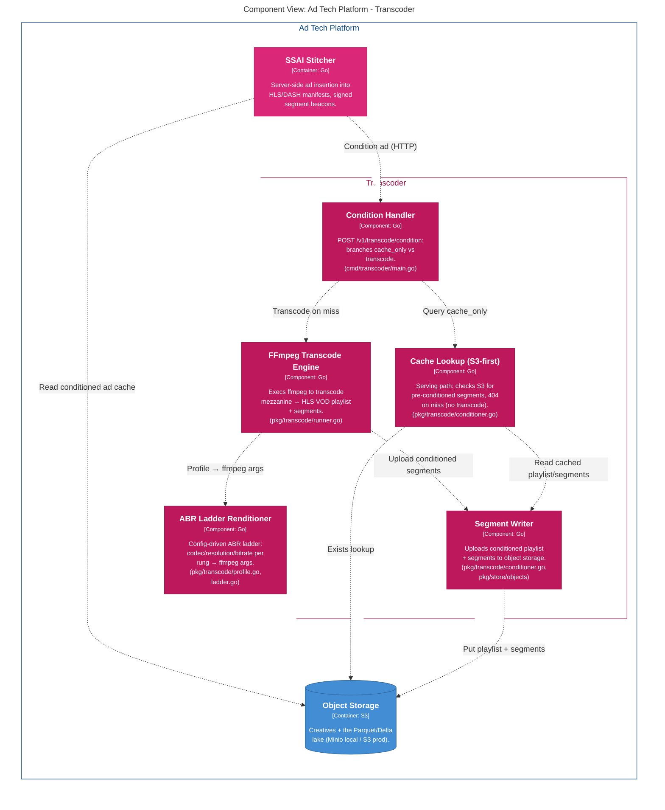

```mermaid
graph LR
  linkStyle default fill:#ffffff

  subgraph diagram ["Component View: Ad Tech Platform - Transcoder"]
    style diagram fill:#ffffff,stroke:#ffffff

    subgraph 9 ["Ad Tech Platform"]
      style 9 fill:#ffffff,stroke:#0b4884,color:#0b4884

      subgraph 79 ["Transcoder"]
        style 79 fill:#ffffff,stroke:#9c144c,color:#9c144c

        80["<div style='font-weight: bold'>Condition Handler</div><div style='font-size: 70%; margin-top: 0px'>[Component: Go]</div><div style='font-size: 80%; margin-top:10px'>POST /v1/transcode/condition:<br />branches cache_only vs<br />transcode.<br />(cmd/transcoder/main.go)</div>"]
        style 80 fill:#be185d,stroke:#9c144c,color:#ffffff
        81["<div style='font-weight: bold'>Cache Lookup (S3-first)</div><div style='font-size: 70%; margin-top: 0px'>[Component: Go]</div><div style='font-size: 80%; margin-top:10px'>Serving path: checks S3 for<br />pre-conditioned segments, 404<br />on miss (no transcode).<br />(pkg/transcode/conditioner.go)</div>"]
        style 81 fill:#be185d,stroke:#9c144c,color:#ffffff
        82["<div style='font-weight: bold'>FFmpeg Transcode Engine</div><div style='font-size: 70%; margin-top: 0px'>[Component: Go]</div><div style='font-size: 80%; margin-top:10px'>Execs ffmpeg to transcode<br />mezzanine → HLS VOD playlist<br />+ segments.<br />(pkg/transcode/runner.go)</div>"]
        style 82 fill:#be185d,stroke:#9c144c,color:#ffffff
        83["<div style='font-weight: bold'>ABR Ladder Renditioner</div><div style='font-size: 70%; margin-top: 0px'>[Component: Go]</div><div style='font-size: 80%; margin-top:10px'>Config-driven ABR ladder:<br />codec/resolution/bitrate per<br />rung → ffmpeg args.<br />(pkg/transcode/profile.go,<br />ladder.go)</div>"]
        style 83 fill:#be185d,stroke:#9c144c,color:#ffffff
        84["<div style='font-weight: bold'>Segment Writer</div><div style='font-size: 70%; margin-top: 0px'>[Component: Go]</div><div style='font-size: 80%; margin-top:10px'>Uploads conditioned playlist<br />+ segments to object storage.<br />(pkg/transcode/conditioner.go,<br />pkg/store/objects)</div>"]
        style 84 fill:#be185d,stroke:#9c144c,color:#ffffff
      end

      149[("<div style='font-weight: bold'>Object Storage</div><div style='font-size: 70%; margin-top: 0px'>[Container: S3]</div><div style='font-size: 80%; margin-top:10px'>Creatives + the Parquet/Delta<br />lake (Minio local / S3 prod).</div>")]
      style 149 fill:#438dd5,stroke:#2e6295,color:#ffffff
      71["<div style='font-weight: bold'>SSAI Stitcher</div><div style='font-size: 70%; margin-top: 0px'>[Container: Go]</div><div style='font-size: 80%; margin-top:10px'>Server-side ad insertion into<br />HLS/DASH manifests, signed<br />segment beacons.</div>"]
      style 71 fill:#db2777,stroke:#b52062,color:#ffffff
    end

    71-. "<div>Read conditioned ad cache</div><div style='font-size: 70%'></div>" .->149
    80-. "<div>Query cache_only</div><div style='font-size: 70%'></div>" .->81
    80-. "<div>Transcode on miss</div><div style='font-size: 70%'></div>" .->82
    82-. "<div>Profile → ffmpeg args</div><div style='font-size: 70%'></div>" .->83
    82-. "<div>Upload conditioned segments</div><div style='font-size: 70%'></div>" .->84
    81-. "<div>Read cached playlist/segments</div><div style='font-size: 70%'></div>" .->84
    81-. "<div>Exists lookup</div><div style='font-size: 70%'></div>" .->149
    84-. "<div>Put playlist + segments</div><div style='font-size: 70%'></div>" .->149
    71-. "<div>Condition ad (HTTP)</div><div style='font-size: 70%'></div>" .->80

  end
```
