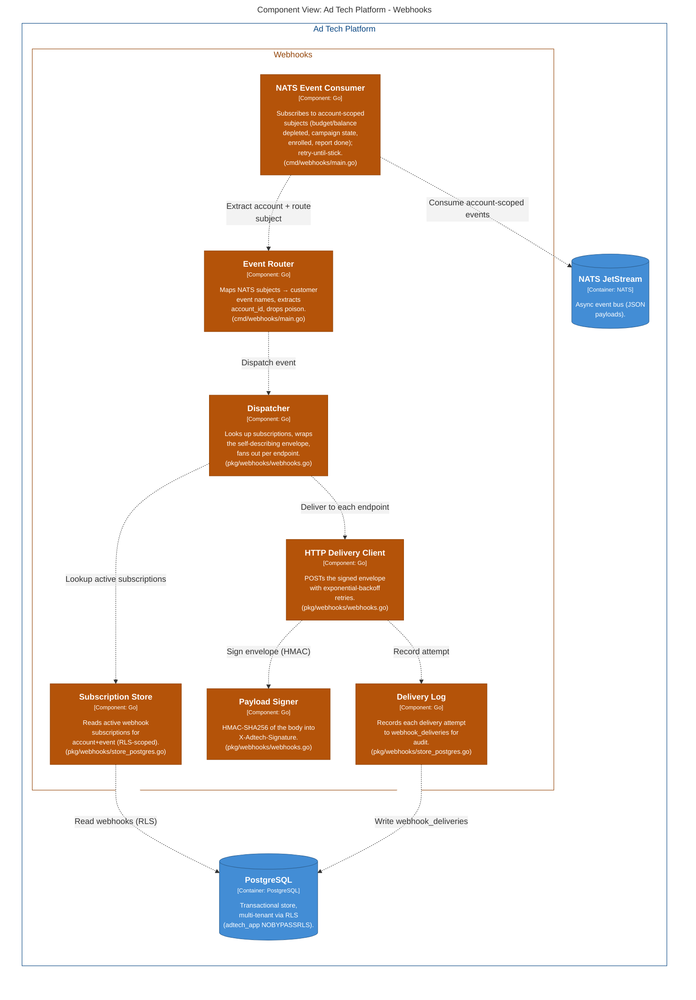

```mermaid
graph LR
  linkStyle default fill:#ffffff

  subgraph diagram ["Component View: Ad Tech Platform - Webhooks"]
    style diagram fill:#ffffff,stroke:#ffffff

    subgraph 9 ["Ad Tech Platform"]
      style 9 fill:#ffffff,stroke:#0b4884,color:#0b4884

      subgraph 125 ["Webhooks"]
        style 125 fill:#ffffff,stroke:#934407,color:#934407

        126["<div style='font-weight: bold'>NATS Event Consumer</div><div style='font-size: 70%; margin-top: 0px'>[Component: Go]</div><div style='font-size: 80%; margin-top:10px'>Subscribes to account-scoped<br />subjects (budget/balance<br />depleted, campaign state,<br />enrolled, report done);<br />retry-until-stick.<br />(cmd/webhooks/main.go)</div>"]
        style 126 fill:#b45309,stroke:#934407,color:#ffffff
        127["<div style='font-weight: bold'>Event Router</div><div style='font-size: 70%; margin-top: 0px'>[Component: Go]</div><div style='font-size: 80%; margin-top:10px'>Maps NATS subjects → customer<br />event names, extracts<br />account_id, drops poison.<br />(cmd/webhooks/main.go)</div>"]
        style 127 fill:#b45309,stroke:#934407,color:#ffffff
        128["<div style='font-weight: bold'>Dispatcher</div><div style='font-size: 70%; margin-top: 0px'>[Component: Go]</div><div style='font-size: 80%; margin-top:10px'>Looks up subscriptions, wraps<br />the self-describing envelope,<br />fans out per endpoint.<br />(pkg/webhooks/webhooks.go)</div>"]
        style 128 fill:#b45309,stroke:#934407,color:#ffffff
        129["<div style='font-weight: bold'>Subscription Store</div><div style='font-size: 70%; margin-top: 0px'>[Component: Go]</div><div style='font-size: 80%; margin-top:10px'>Reads active webhook<br />subscriptions for<br />account+event (RLS-scoped).<br />(pkg/webhooks/store_postgres.go)</div>"]
        style 129 fill:#b45309,stroke:#934407,color:#ffffff
        130["<div style='font-weight: bold'>HTTP Delivery Client</div><div style='font-size: 70%; margin-top: 0px'>[Component: Go]</div><div style='font-size: 80%; margin-top:10px'>POSTs the signed envelope<br />with exponential-backoff<br />retries.<br />(pkg/webhooks/webhooks.go)</div>"]
        style 130 fill:#b45309,stroke:#934407,color:#ffffff
        131["<div style='font-weight: bold'>Payload Signer</div><div style='font-size: 70%; margin-top: 0px'>[Component: Go]</div><div style='font-size: 80%; margin-top:10px'>HMAC-SHA256 of the body into<br />X-Adtech-Signature.<br />(pkg/webhooks/webhooks.go)</div>"]
        style 131 fill:#b45309,stroke:#934407,color:#ffffff
        132["<div style='font-weight: bold'>Delivery Log</div><div style='font-size: 70%; margin-top: 0px'>[Component: Go]</div><div style='font-size: 80%; margin-top:10px'>Records each delivery attempt<br />to webhook_deliveries for<br />audit.<br />(pkg/webhooks/store_postgres.go)</div>"]
        style 132 fill:#b45309,stroke:#934407,color:#ffffff
      end

      145[("<div style='font-weight: bold'>PostgreSQL</div><div style='font-size: 70%; margin-top: 0px'>[Container: PostgreSQL]</div><div style='font-size: 80%; margin-top:10px'>Transactional store,<br />multi-tenant via RLS<br />(adtech_app NOBYPASSRLS).</div>")]
      style 145 fill:#438dd5,stroke:#2e6295,color:#ffffff
      148[("<div style='font-weight: bold'>NATS JetStream</div><div style='font-size: 70%; margin-top: 0px'>[Container: NATS]</div><div style='font-size: 80%; margin-top:10px'>Async event bus (JSON<br />payloads).</div>")]
      style 148 fill:#438dd5,stroke:#2e6295,color:#ffffff
    end

    126-. "<div>Consume account-scoped events</div><div style='font-size: 70%'></div>" .->148
    126-. "<div>Extract account + route<br />subject</div><div style='font-size: 70%'></div>" .->127
    127-. "<div>Dispatch event</div><div style='font-size: 70%'></div>" .->128
    128-. "<div>Lookup active subscriptions</div><div style='font-size: 70%'></div>" .->129
    128-. "<div>Deliver to each endpoint</div><div style='font-size: 70%'></div>" .->130
    130-. "<div>Sign envelope (HMAC)</div><div style='font-size: 70%'></div>" .->131
    130-. "<div>Record attempt</div><div style='font-size: 70%'></div>" .->132
    129-. "<div>Read webhooks (RLS)</div><div style='font-size: 70%'></div>" .->145
    132-. "<div>Write webhook_deliveries</div><div style='font-size: 70%'></div>" .->145

  end
```
